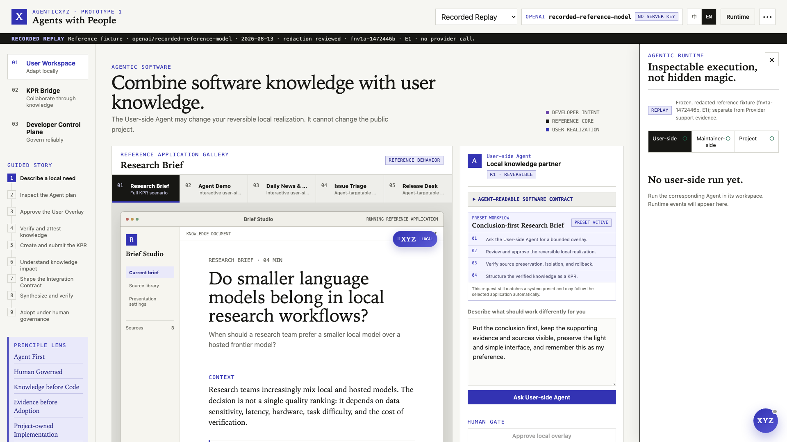
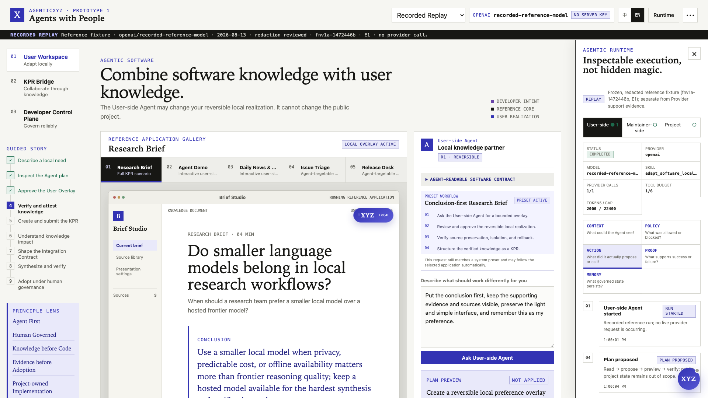
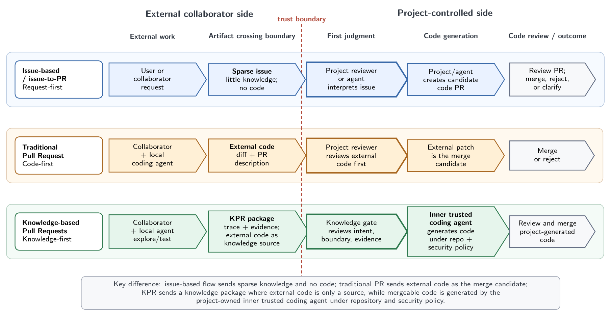
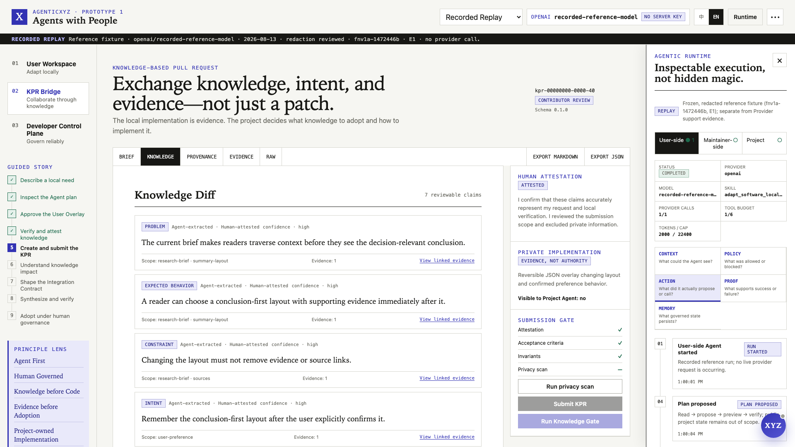
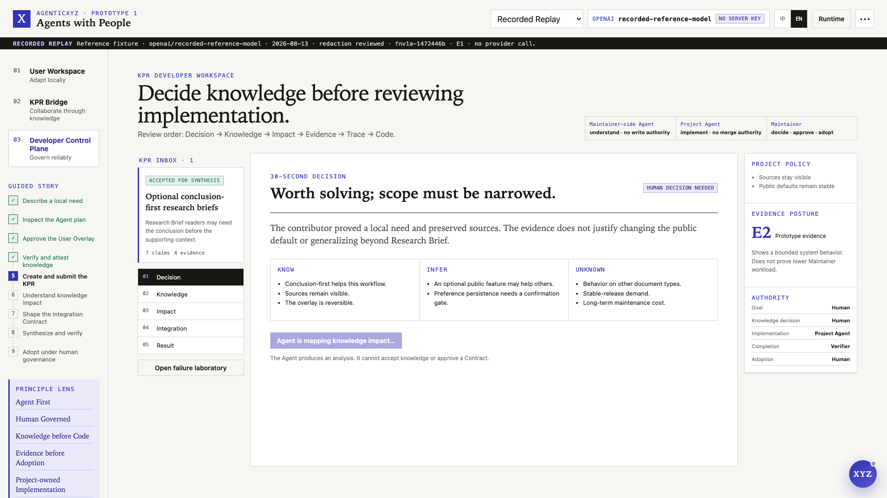
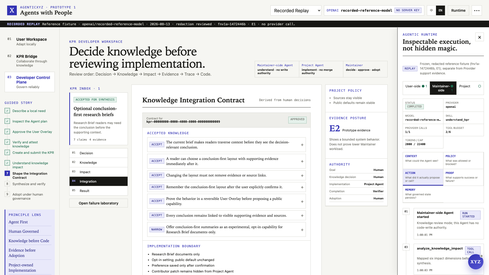
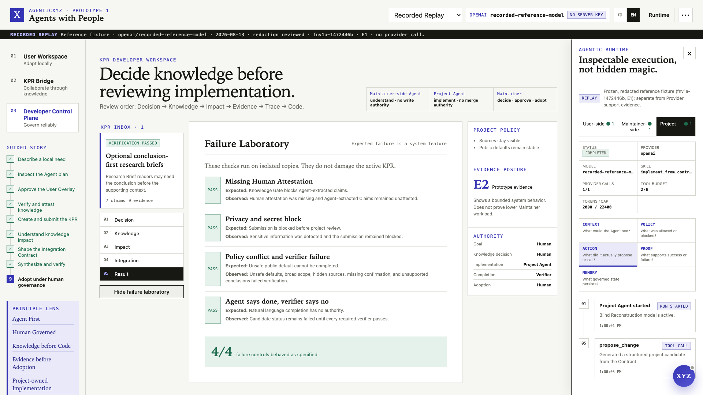
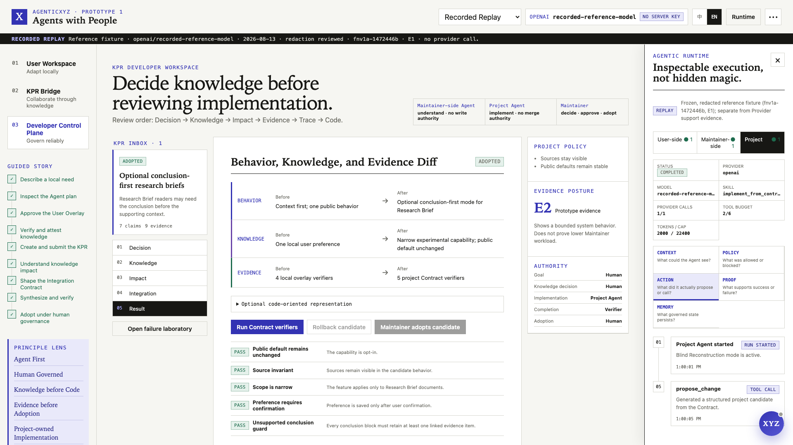

# AgenticXYZ Prototype 1

**English** | [简体中文](README.zh-CN.md)

**Published article:** [AgenticXYZ Prototype 1: A Knowledge Collaboration Layer for People and Agents](https://agenticxyz.ai/writing/prototype-1-knowledge-collaboration)

> **X / Crossing · Agents with People · Human in the Loop**<br>
> **Agent-centered by architecture. Human-governed by design.**

AgenticXYZ Prototype 1 is an executable design exploration of one question:

> If Agents become a default substrate for future software, how should people, Agents, and software projects work together while goals, judgment, responsibility, and final governance remain human?

This is an article-first prototype and visual reference system—not a general Agent platform, an autonomous coding product, or a replacement for GitHub. It demonstrates how software can become readable and operable by Agents, how a user's local experience can become a **Knowledge-based Pull Request (KPR)**, and how a project can adopt that knowledge without surrendering authority to a model.



## The design thesis

The browser became a common application substrate. AgenticXYZ starts from the hypothesis that an Agent runtime may become another such substrate: future applications may be designed from the beginning so that their knowledge, capabilities, state, policy, and evidence are legible to Agents.

That does **not** mean giving an Agent final authority.

- **Agent First is an architecture principle.** Core capabilities are structured, discoverable, callable, composable, and verifiable by Agents.
- **Human Governance is a power principle.** People retain goals, preferences, risky authorization, knowledge decisions, public product choices, responsibility, and final adoption.
- **Software is executable knowledge.** Code, product intent, defaults, constraints, documentation, tests, evidence, and historical decisions all form the software.
- **Reliability comes from subtraction.** The system exposes only bounded actions whose inputs, authority, risk, effects, and proof can be defined.
- **Agents strengthen collaboration between people.** They help users express situated knowledge and help maintainers review it, without impersonating either person.

Prototype 1 can be summarized by three imperatives:

> **Adapt locally. Collaborate through knowledge. Govern reliably.**

## The three connected surfaces

| Surface | Design question | What the prototype makes visible |
|---|---|---|
| **Agentic Software / User Workspace** | How can an Agent combine software knowledge with user knowledge? | Agent-readable contracts, reversible User Overlays, local checkpoints, previews, scoped capabilities, and Verifiers |
| **KPR Bridge** | How can Agents improve knowledge collaboration between people? | Human-attested Claims, intent, expected behavior, Knowledge Diff, provenance, evidence, limitations, and impact |
| **Developer Control Plane / Agentic Runtime** | How can probabilistic model behavior become controlled and predictable? | Role authority, typed proposals, policy and risk gates, inspectable events, budgets, verification, rollback, and human adoption |

The system contains three Agent roles with deliberately different authority:

| Role | Can do | Cannot do |
|---|---|---|
| **User-side Agent** | Understand a local need and propose a reversible user realization | Change the public project or attest on behalf of the user |
| **Maintainer-side Agent** | Organize Claims, separate known/inferred/unknown, and map impact | Accept project knowledge or approve an Integration Contract |
| **Project Agent** | Reconstruct a project-owned candidate from an approved Contract | Read the private contributor trajectory, declare itself verified, merge, or adopt |

## The end-to-end story

```text
Human experience
→ local Agent exploration
→ reversible and verified User Overlay
→ human-attested Knowledge-based Pull Request
→ Maintainer knowledge decisions
→ approved Knowledge Integration Contract
→ Project Agent blind reconstruction
→ behavior, knowledge, and evidence verification
→ human rollback, rebuild, or adoption
```

The canonical demonstration follows one small but complete scenario:

1. A reader asks for the conclusion of a Research Brief to appear before its supporting context.
2. The User-side Agent reads the software contract and proposes a reversible local overlay; the public project remains unchanged.
3. The user previews, approves, and verifies the local behavior.
4. The Agent structures the experience as a KPR. The user reviews the Claims, corrects wording where necessary, and explicitly attests the submitted meaning and scope.
5. The Maintainer-side Agent creates a decision brief and an impact map, but the Maintainer decides which knowledge to accept, modify, narrow, defer, reject, or return for evidence.
6. Human decisions become a Knowledge Integration Contract containing accepted knowledge, protected invariants, implementation boundaries, and required Verifiers.
7. The Project Agent reconstructs a project-owned implementation from the Contract without seeing the contributor patch or private trajectory.
8. Verifiers—not Agent language—decide whether the candidate is complete.
9. The Maintainer can inspect the behavior, knowledge, and evidence diff, roll back, rebuild, or finally adopt the candidate.

## What the screenshots demonstrate

### 1. Software can be an Agent-readable and reversible workspace

The reference application and User-side Agent stay side by side. The Agent reads explicit software knowledge, proposes only a local realization, creates a checkpoint, and exposes verification and rollback before the experience can become a contribution.



The software knowledge is separated into **Developer Intent / Policy**, a shared **Reference Capability Core**, and the user's local **Realization / Overlay**. Personal adaptation therefore does not silently mutate the public product.

### 2. A KPR reviews knowledge before code

A KPR is not a larger PR description. Its primary review object is what the project might learn: the problem, intended and expected behavior, acceptance criteria, Claims, provenance, evidence, counterexamples, uncertainty, protected invariants, and Human Attestation.



*Source: [Knowledge-Based Pull Requests (arXiv:2606.26721)](https://arxiv.org/abs/2606.26721).*



The user's local implementation remains visible as evidence that a behavior worked in one bounded environment. It is not treated as implementation authority for the public project.

### 3. The Maintainer receives a decision surface, not an Agent verdict

The Developer Control Plane begins with a compact brief that separates **Know**, **Infer**, and **Unknown**. The Maintainer can understand the proposal before reading implementation details and can preserve the project's own taste, scope, and product intent.



The claim that this reduces cognitive burden is a design hypothesis, not a measured result. The prototype makes the proposed decision surface inspectable so that it can later be evaluated against ordinary Issue and PR workflows.

### 4. Human decisions compile into an Integration Contract

Accepted, modified, narrowed, and rejected knowledge is converted into an explicit Contract. The Project Agent implements from this approved boundary rather than copying the user's patch.



This is **Blind Reconstruction**: the project adopts knowledge, then generates an implementation consistent with its own Policy, architecture, and required Verifiers.

### 5. Verification and rollback are product behavior

The failure laboratory demonstrates missing Human Attestation, privacy leakage, policy conflict, unsupported Verifiers, an Agent saying “done” before proof exists, and rollback. Expected failure is treated as a system feature rather than hidden demo friction.



The final screen compares changes in behavior, knowledge, and evidence. Completion belongs to Verifiers; adoption belongs to the Maintainer.



## Reference applications and nested XYZ Agents

The workbench includes multiple software targets so the central application is visibly different from the surrounding explanation:

| Reference application | Purpose |
|---|---|
| **Research Brief** | Complete governed path from local preference to KPR, Contract, Project reconstruction, and human adoption |
| **Agent Demo** | Reversible user-side addition of an interactive terminal sidebar and presentation preferences |
| **Daily News & Notes** | Reversible capability reuse and reconstruction of a user-facing news workspace |
| **Issue Triage** | Read-only preview of an Agent-targetable issue workflow |
| **Release Desk** | Read-only preview of an Agent-targetable release workflow |

Every application contains a draggable **Local XYZ Agent** whose scope ends at that application. The fixed bottom-right **Global XYZ Agent** can guide the whole workbench, configure the Provider, switch views and applications, explain concepts, and point to the next action. Local and Global Agents share governed capability state, but their authority boundaries are different and visible.

## Try the static replay

[Open the GitHub Pages demo](https://agenticxyz.github.io/AgenticXYZ-Prototype-1/).

The Pages build runs **Recorded Replay** and **Scripted Fallback** entirely in the browser. It does not run the localhost Gateway, accept API keys, call OpenAI, Anthropic, or DeepSeek, or produce new Live Agent evidence. For Provider-backed runs, clone the project and use the local setup below.

## Run locally

Requirements: Node.js 20 or newer and npm.

```bash
npm ci
npm run dev
```

Open [http://127.0.0.1:4173](http://127.0.0.1:4173).

The complete **Recorded Replay** and **Scripted Fallback** paths require no API key. Recorded Replay is the recommended first experience because it is deterministic, redacted, and reproduces the full governed flow.

### Use a live Agent

1. Open the Provider/model control in the upper-right corner.
2. Choose one Provider and model.
3. Enter an API key and select **Test connection & use**.
4. Run the same role-governed workflow with the selected model.

The browser sends the key only to the localhost Gateway. The key stays in that Node process's memory and is not written to browser storage, exports, screenshots, KPRs, or replay artifacts. Restarting the Gateway clears keys entered through the page. Server-side `.env.local` configuration is also supported; copy [`.env.example`](.env.example) and configure exactly one Provider.

| Mode | Provider call | Intended use |
|---|---:|---|
| **Live Agent** | Yes | Credentialed local exploration and creation of reviewable run evidence |
| **Recorded Replay** | No | Deterministic article, screenshot, and complete reference flow |
| **Scripted Fallback** | No | No-key walkthrough, CI, and fixed failure branches; never presented as model output |

OpenAI, Anthropic, and DeepSeek drivers have Mock Contract coverage. The bundled DeepSeek V4 Flash/high record is human-reviewed for **Prototype reference scope only**; it is not a production-readiness claim. See [Provider support and evidence status](docs/provider-support.md).

## Inspect and verify the system

```bash
npm run release:audit
```

The release audit covers type checking, unit and Provider contract tests, secret and personal-path scanning, replay and screenshot checksums, specification-checklist closure, a production build, the complete browser journey, accessibility, console errors, and responsive layouts.

The prototype is organized around five machine-readable objects:

- **`ProjectManifest`** — software knowledge, capabilities, mutable surfaces, risks, and Verifiers that an Agent can read.
- **`ProjectPolicy`** — product intent, protected invariants, privacy constraints, role authority, and human gates.
- **`AgentRun`** — append-only, redacted events projected into Context, Policy, Action, Proof, and Memory planes.
- **`ChangeWorkspace`** — isolated structured changes, checkpoints, candidate state, evidence, and rollback.
- **`KPR`** — human-attested knowledge, intent, evidence, decisions, impact, and the Integration Contract.

Schemas live in [`schemas/`](schemas/); the software contract is in [`reference-app/`](reference-app/); the KPR protocol is in [`protocol/`](protocol/); and deterministic plus reviewed evidence is in [`recorded-runs/`](recorded-runs/).

## Evidence boundary

This repository demonstrates bounded state transitions, role separation, reversible local changes, Human Attestation, privacy blocking, knowledge decisions, Contract construction, Project Agent reconstruction, verifier-driven completion, rollback, deterministic replay, and final human adoption.

It does **not** establish that KPRs reduce Maintainer workload, improve contribution quality, or generalize across software domains. It is not a production sandbox and has no authentication system, database, autonomous merge, payment, token revenue sharing, reinforcement-learning pipeline, or self-modifying Agent. These remain research or future ecosystem questions.

## Read more

- [Design article](article/prototype-1.md) · [设计文章（中文）](article/prototype-1.zh-CN.md)
- [Guided walkthrough](docs/walkthrough.md)
- [Architecture](docs/architecture.md)
- [Known limitations](docs/limitations.md)
- [Development specification](docs/development-specification.md)
- [Decision record](docs/decisions.md)
- [Release audit](docs/release-audit.md)

## License and citation

Code and original project materials are available under the [MIT License](LICENSE). Citation metadata is provided in [`CITATION.cff`](CITATION.cff).

> **Agents with People. Human in the Loop.**
