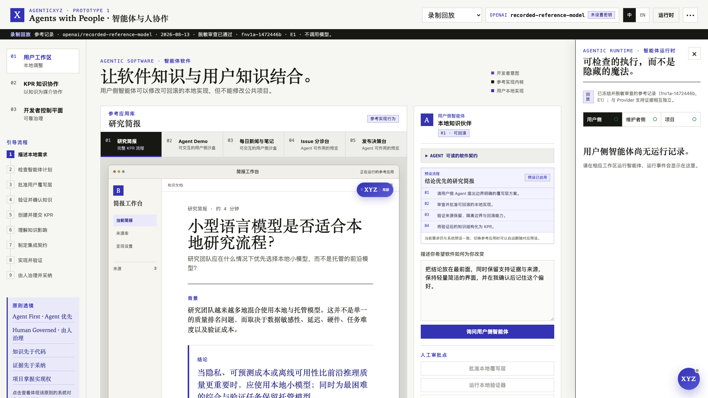
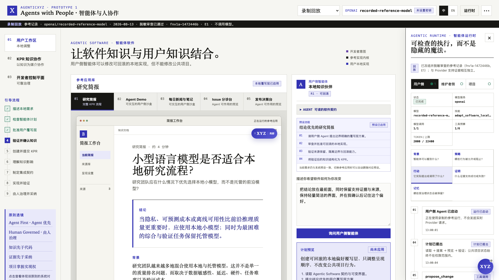
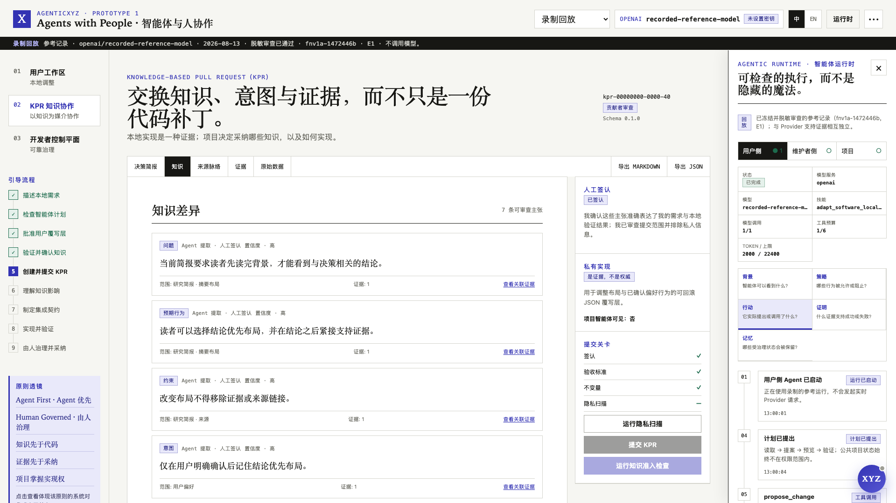
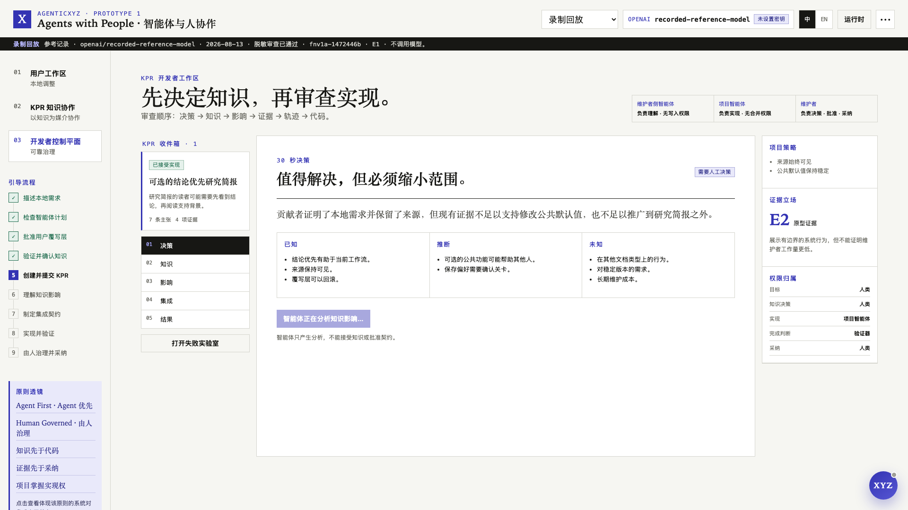
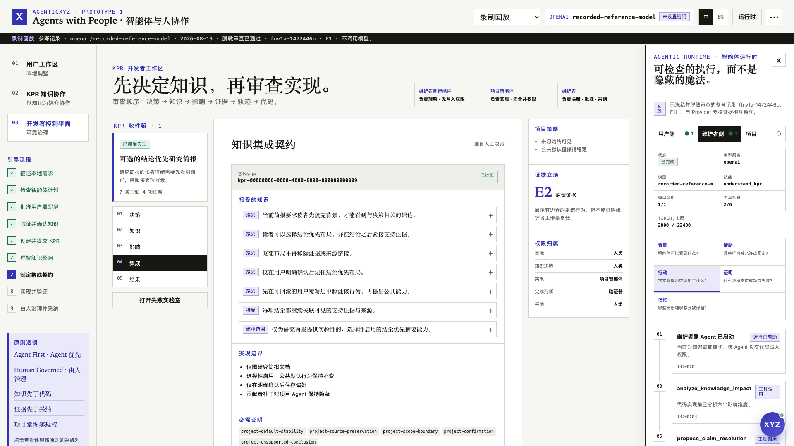
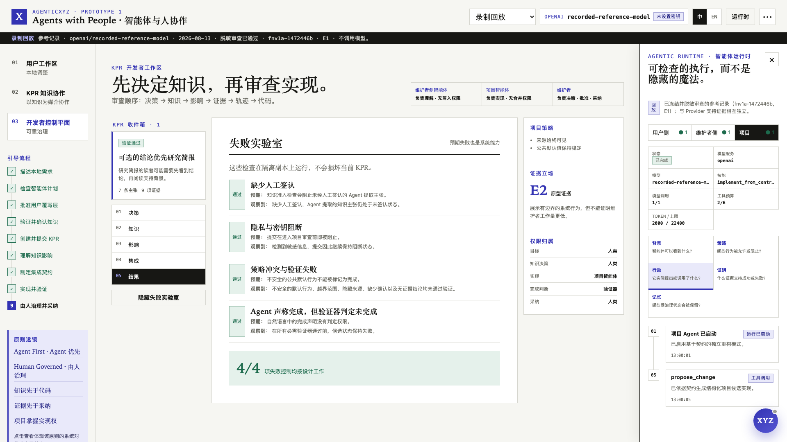
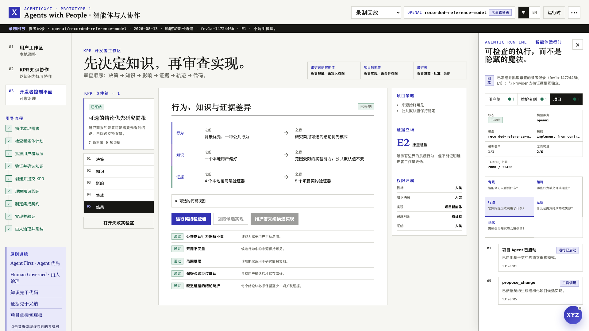

# AgenticXYZ Prototype 1

[English](README.md) | **简体中文**

**配套发布文章：** [AgenticXYZ Prototype 1：面向人与 Agent 的知识协作层](https://agenticxyz.ai/writing/prototype-1-knowledge-collaboration)

> **X / Crossing · Agents with People · Human in the Loop**<br>
> **架构以 Agent 为中心，权力由人治理。**

AgenticXYZ Prototype 1 是一个可以实际运行的设计探索，它试图回答一个问题：

> 如果 Agent 将来会成为软件的默认底座，我们应该怎样设计人与 Agent、人与人、Agent 与项目之间的协作，同时让目标、判断、责任与最终治理仍然属于人？

这是一个以文章观点为核心的 Prototype 和可视化参考系统，而不是通用 Agent 平台、自动 Coding 产品或 GitHub 替代品。它展示软件如何从一开始就对 Agent 友好，用户的本地经验如何形成 **Knowledge-based Pull Request（KPR）**，以及项目如何吸收这些知识而不把权力交给模型。



## 设计理念

浏览器曾经成为应用的通用底座。AgenticXYZ 从一个类似的假设出发：Agent Runtime 也可能成为未来软件的智能底座，因此应用的知识、能力、状态、Policy 和证据应该从设计之初就对 Agent 可读。

但这并不意味着让 Agent 拥有最终决定权。

- **Agent First 是架构原则。** 核心能力应该对 Agent 可发现、可调用、可组合、可验证。
- **Human Governance 是权力原则。** 目标、偏好、高风险授权、知识判断、公共产品选择、责任与最终采纳仍然属于人。
- **软件是一种可执行的知识形态。** 代码、产品意图、默认行为、约束、文档、测试、证据和历史决策共同构成软件。
- **可靠性来自做减法。** 系统只暴露那些能够明确输入、权限、风险、影响与验证方式的有边界行为。
- **Agent 的作用是加强人与人之间的协作。** Agent 帮助用户表达情境知识，也帮助维护者理解这些知识，但不冒充任何一方作出判断。

Prototype 1 可以被概括为三个行动原则：

> **本地适配，以知识协作，以可靠性治理。**

## 三个相互连接的系统界面

| 系统界面 | 设计问题 | Prototype 中的可见机制 |
|---|---|---|
| **Agentic Software / 用户工作区** | Agent 如何把软件知识与用户知识结合起来？ | Agent 可读的软件契约、可逆 User Overlay、本地 Checkpoint、预览、作用域能力与 Verifier |
| **KPR Bridge** | Agent 如何加强人与人之间的知识协作？ | Human-attested Claim、意图、预期行为、Knowledge Diff、来源、证据、限制与影响 |
| **开发者控制面 / Agentic Runtime** | 如何让概率性的模型行为变得可控、可预测？ | 角色权限、结构化 Proposal、Policy 与风险门、可检查事件、预算、验证、回滚与人的最终采纳 |

系统中的三个 Agent 角色拥有刻意区分的权限：

| 角色 | 可以做什么 | 不能做什么 |
|---|---|---|
| **用户侧 Agent** | 理解本地需求，提出可回滚的用户侧实现 | 修改公共项目，或替用户完成知识签认 |
| **维护者侧 Agent** | 整理 Claim，区分已知、推断和未知，分析影响 | 接受项目知识，或批准 Integration Contract |
| **项目 Agent** | 根据已批准的 Contract 重新构造项目自己的候选实现 | 读取贡献者私人轨迹、自行宣称验证完成、合并或采纳 |

## 端到端协作故事

```text
人的真实经验
→ 本地 Agent 探索
→ 可回滚、经过验证的 User Overlay
→ 由人签认的 Knowledge-based Pull Request
→ 维护者进行知识决策
→ 人批准 Knowledge Integration Contract
→ 项目 Agent 盲重构
→ 行为、知识与证据验证
→ 人决定回滚、重建或采纳
```

标准演示使用一个足够小、但流程完整的场景：

1. Research Brief 的读者希望先看到结论，再阅读支持结论的上下文。
2. 用户侧 Agent 读取软件契约并提出一个可逆的本地 Overlay；公共项目保持不变。
3. 用户预览、批准并验证本地行为。
4. Agent 把这段经验组织成 KPR。用户审查其中的 Claim，在需要时修正措辞，并明确签认提交的含义与范围。
5. 维护者侧 Agent 生成 Decision Brief 和 Impact Map，但由维护者决定对每条知识进行 Accept、Modify、Narrow、Defer、Reject 或 Request Evidence。
6. 人的决定形成 Knowledge Integration Contract，其中包含被接受的知识、受保护不变量、实现边界与必须运行的 Verifier。
7. 项目 Agent 根据 Contract 重新实现项目自己的候选版本，但看不到用户 Patch 和私人轨迹。
8. 是否完成由 Verifier 决定，而不是由 Agent 的自然语言决定。
9. 维护者可以检查行为、知识与证据的变化，回滚、重新构建或最终采纳候选版本。

## 运行截图说明了什么

### 1. 软件可以成为 Agent 可读、可回滚的工作区

参考应用与用户侧 Agent 始终左右并列。Agent 读取显式的软件知识，只提出本地实现；在这段经验成为贡献之前，系统会创建 Checkpoint，并提供验证与回滚。



软件知识被分为 **Developer Intent / Policy**、共享的 **Reference Capability Core** 和用户本地的 **Realization / Overlay**。因此，用户的个性化调整不会静默修改公共产品。

### 2. KPR 先审查知识，再审查代码

KPR 不是一段更长的 PR 描述。它首先让开发者审查项目可能吸收的知识：问题、意图与预期行为、验收标准、Claim、来源、证据、反例、不确定性、受保护不变量和 Human Attestation。



用户本地的实现仍然是证据，可以说明一个行为曾经在特定环境中成立；但它不是公共项目的实现权威。

### 3. 维护者看到的是决策界面，而不是 Agent 结论

开发者控制面首先提供一个紧凑的 Decision Brief，把信息区分为 **Know、Infer、Unknown**。维护者可以在阅读实现细节之前理解贡献，并保留项目自己的品味、范围和产品意图。



“这种界面能够降低维护者认知负担”目前仍然是设计假设，而不是实验结论。Prototype 的作用是把这套决策界面做成可检查的系统，从而为未来与普通 Issue / PR 流程进行对照评估创造条件。

### 4. 人的知识决定被编译成 Integration Contract

被接受、修改、收窄或拒绝的知识会形成显式 Contract。项目 Agent 从这个经过批准的边界开始实现，而不是复制用户的 Patch。



这就是 **Blind Reconstruction（盲重构）**：项目先吸收知识，再依据自身 Policy、架构与 Verifier 生成项目自己的实现。

### 5. 验证与回滚本身就是产品行为

Failure Laboratory 展示缺少 Human Attestation、隐私泄漏、Policy 冲突、不受支持的 Verifier、Agent 在缺少证据时声称“完成”，以及回滚。可预期的失败不是 Demo 中被隐藏的阻碍，而是系统可靠性的一部分。



最终界面同时比较行为、知识和证据的变化。完成状态属于 Verifier，最终采纳权属于维护者。



## 参考应用与嵌套的 XYZ 助手

工作台包含多个不同的软件目标，让中间的参考应用在视觉和交互上与外部说明界面清楚区分：

| 参考应用 | 用途 |
|---|---|
| **Research Brief** | 从本地偏好、KPR、Contract、项目重构到人的最终采纳的完整治理流程 |
| **Agent Demo** | 在用户侧可逆地添加交互式终端侧边栏和界面偏好 |
| **Daily News & Notes** | 可逆地复用能力并重构用户侧新闻工作区 |
| **Issue Triage** | Agent 可操作 Issue 流程的只读预览 |
| **Release Desk** | Agent 可操作发布流程的只读预览 |

每个应用都有一个可以拖动的 **局部 XYZ 助手**，作用域只限当前应用。固定在右下角的 **全局 XYZ 助手** 可以引导整个工作台、设置 Provider、切换视图与应用、解释概念并指出下一步操作。局部和全局助手共享受治理的能力状态，但两者的权限边界不同，而且始终可见。

## 本地运行

环境要求：Node.js 20 或更新版本，以及 npm。

```bash
npm ci
npm run dev
```

打开 [http://127.0.0.1:4173](http://127.0.0.1:4173)。

完整的 **Recorded Replay** 和 **Scripted Fallback** 不需要 API Key。推荐第一次使用时选择 Recorded Replay，因为它是确定性的、已经脱敏，并且能够复现完整的治理流程。

### 接入真实 Agent

1. 点击右上角的 Provider / 模型设置。
2. 选择一个 Provider 和模型。
3. 输入 API Key，点击 **Test connection & use**。
4. 使用选定模型运行同一条具有角色权限和治理边界的流程。

浏览器只会把 Key 发送给本机 Gateway。Key 仅保留在该 Node 进程的内存中，不会写入浏览器存储、导出文件、截图、KPR 或 Replay。重启 Gateway 会清除通过网页输入的 Key。系统也支持服务端 `.env.local` 配置；复制 [`.env.example`](.env.example) 并只配置一个 Provider 即可。

| 模式 | 是否调用 Provider | 用途 |
|---|---:|---|
| **Live Agent** | 是 | 使用真实凭据进行本地探索，并形成可审查的运行证据 |
| **Recorded Replay** | 否 | 确定性文章、截图与完整参考流程 |
| **Scripted Fallback** | 否 | 无 Key 演示、CI 与固定失败分支；不会冒充模型输出 |

OpenAI、Anthropic 与 DeepSeek Driver 均具有 Mock Contract 覆盖。仓库中的 DeepSeek V4 Flash/high 记录只经过了 **Prototype reference scope** 的人工审阅，不代表生产就绪。详细状态见 [Provider 支持与证据边界](docs/provider-support.md)。

## 检查与验证系统

```bash
npm run release:audit
```

发布审计包括类型检查、单元测试与 Provider Contract 测试、敏感信息与个人路径扫描、Replay 和截图校验、规范验收项、生产构建、完整浏览器流程、可访问性、控制台错误和响应式布局。

Prototype 围绕五个机器可读的核心对象组织：

- **`ProjectManifest`**：Agent 可以读取的软件知识、能力、可修改表面、风险和 Verifier。
- **`ProjectPolicy`**：产品意图、受保护不变量、隐私约束、角色权限和 Human Gate。
- **`AgentRun`**：追加式、脱敏的事件记录，并投影为 Context、Policy、Action、Proof 和 Memory。
- **`ChangeWorkspace`**：隔离的结构化修改、Checkpoint、候选状态、证据与回滚。
- **`KPR`**：经过人签认的知识、意图、证据、决定、影响与 Integration Contract。

Schema 位于 [`schemas/`](schemas/)，软件契约位于 [`reference-app/`](reference-app/)，KPR Protocol 位于 [`protocol/`](protocol/)，确定性与人工审阅证据位于 [`recorded-runs/`](recorded-runs/)。

## 证据边界

这个仓库实际展示了有边界的状态转换、角色隔离、可逆本地修改、Human Attestation、隐私阻断、知识决策、Contract 构造、项目 Agent 重构、Verifier 驱动完成、回滚、确定性 Replay 和人的最终采纳。

它没有证明 KPR 能够降低维护者工作量、提高贡献质量或适用于所有软件领域。它也不是生产级 Sandbox，没有身份认证、数据库、自动合并、支付、Token 分成、强化学习管线或自我修改 Agent。这些仍然属于研究问题或未来生态构想。

## 延伸阅读

- [Design article](article/prototype-1.md) · [设计文章（中文）](article/prototype-1.zh-CN.md)
- [引导演示](docs/walkthrough.md)
- [系统架构](docs/architecture.md)
- [已知限制](docs/limitations.md)
- [开发规范](docs/development-specification.md)
- [决策记录](docs/decisions.md)
- [发布审计](docs/release-audit.md)

## 许可证与引用

代码与原创项目材料使用 [MIT License](LICENSE)。引用信息见 [`CITATION.cff`](CITATION.cff)。

> **Agents with People. Human in the Loop.**
