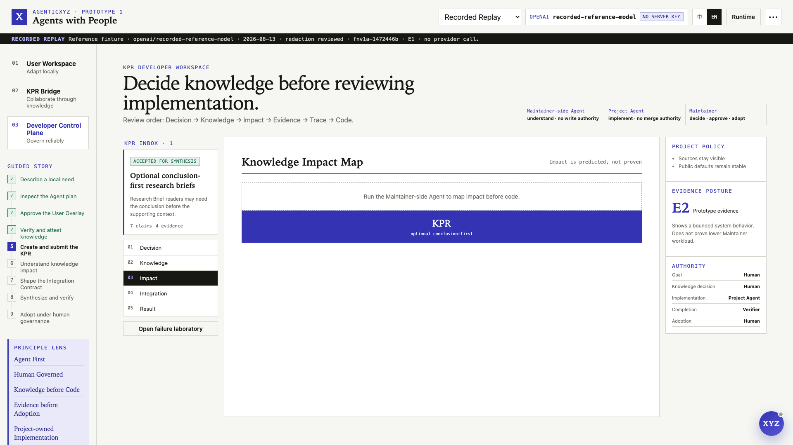

# AgenticXYZ Prototype 1: Turning Human Experience into Project Knowledge

> **X · Agents with People · Human in the Loop**<br>
> **Agent-centered by architecture. Human-governed by design.**

Imagine that you are reading a Research Brief. The sources are useful, but you always want the conclusion first. Today, you can adapt your own copy with an Agent. The harder question comes next: if that change is genuinely useful, how can your experience reach the people who maintain the software without becoming a vague feature request or an unreviewable pile of generated code?

AgenticXYZ Prototype 1 explores that entire path.

> Every person can work with their own Agent, every project can work with a Project Agent, and goals, judgment, responsibility, and final governance remain human.

The prototype is not a general Agent platform and it is not an attempt to replace GitHub. It is a small, executable argument about how people and Agents might work together when software itself becomes an Agent-readable environment.

## The starting point is not a chat box

Browsers became a common foundation for software because they offered more than a place to display text. They gave applications a shared runtime. AgenticXYZ starts from a similar hypothesis: Agents may become another common software substrate.

If that happens, adding a chat box beside an existing product will not be enough. An Agent needs to know what the software is for, which capabilities exist, what can change, who may authorize a change, what must never change, and how a result can be checked. Without that structure, a powerful model is still guessing at the edges of the product.

Prototype 1 therefore treats an Agent as a first-class participant in the software architecture. Capabilities, state, policy, and proof are written so an Agent can read and use them. This is what **Agent-centered** means here.

It does not mean that the Agent gets the final say. People still set goals, make product choices, authorize risky actions, accept knowledge, and take responsibility. This is what **Human-governed** means.

Agent First is an architecture principle. Human Governance is a power principle.

## One flow connects three problems

The prototype brings together three questions that are often treated separately.

First, how can an Agent help a person use and adapt software? A user should be able to combine the project's public knowledge with local needs without silently changing the public product.

Second, how can Agents improve collaboration between people? A user's real experience should reach a Maintainer as clear, reviewable knowledge rather than a loose conversation or an unexplained patch.

Third, how can a developer keep Agent behavior controlled and predictable? Every important action needs a scope, permission boundary, checkpoint, evidence requirement, and rollback path.

Prototype 1 turns these questions into one visible journey:

```text
Human experience
→ reversible local change with a User-side Agent
→ human-attested Knowledge-based Pull Request
→ Maintainer knowledge decisions
→ approved Knowledge Integration Contract
→ Project Agent reconstruction
→ independent verification
→ human adoption or rollback
```

## A local change stays local until a person decides otherwise

The reference application separates software knowledge into three layers:

1. **Developer Intent and Policy** explain what the project is trying to do, what it protects, and which trade-offs its Maintainer prefers.
2. **Reference Capability Core** contains the shared behavior, structured capabilities, and Verifiers.
3. **User Realization or Overlay** contains reversible changes that affect one user's experience.

In the guided story, a user asks for the conclusion of a Research Brief to appear before the supporting context. The User-side Agent reads the application's contract, proposes a local Overlay, creates a Checkpoint, and shows the result. The sources remain intact and the public default does not change.

This distinction matters. The user gets immediate value without waiting for a release, while the project receives no public change without an explicit contribution and review process.


## KPR asks the project to review knowledge before code

An ordinary Issue usually says that something is missing or broken. An ordinary Pull Request submits one implementation. With Coding Agents, producing a patch is becoming easier, but understanding whether the patch expresses the right knowledge can become harder.

A **Knowledge-based Pull Request (KPR)** changes the order of review. It packages:

- the user's situation and intended behavior;
- acceptance criteria and protected behavior;
- Claims extracted by the Agent;
- the user's explicit attestation of meaning and scope;
- evidence, counterexamples, uncertainty, and provenance;
- the local implementation as supporting material.

The patch is evidence that a behavior worked in one environment. It is not authority over the public implementation.

Human Attestation is a real boundary. The Agent can help the user write clearly, but it cannot turn its own interpretation into a statement attributed to that person. The user reviews every Claim and signs off on the final meaning. If the Agent's wording is already accurate, the user does not need to make a performative edit; correction and attestation remain separate events.

This is the main purpose of KPR: let Agents translate experience into a form another person can inspect without removing either person's judgment.


## The Maintainer receives a decision surface, not an Agent verdict

When the KPR reaches the project side, the Maintainer-side Agent first separates what is known, what is inferred, and what is still unknown. It also maps likely effects on behavior, product preference, compatibility, rollout, and verification.

The Maintainer then decides what the project should learn. Each Claim can be accepted, modified, narrowed, deferred, rejected, or returned for more evidence. The Agent helps organize the decision; it does not make the decision.

In the reference story, the local experiment shows that conclusion-first reading works for one person. The project does not turn that preference into a new default for everyone. The Maintainer narrows it into an experimental, opt-in capability for Research Brief documents and requires explicit permission before the preference can be remembered.

This is where software keeps its character. A model can generate many plausible implementations, but a project still needs a human who decides what belongs in it.



## The project implements from a human-approved Contract

The Maintainer's decisions become a **Knowledge Integration Contract**. It records the knowledge the project accepts, the generalizations it rejects, the behavior that must remain unchanged, the allowed implementation boundary, open questions, and the Verifiers that must pass.

The Project Agent then performs **Blind Reconstruction** from that Contract. It can read project-owned Policy and reference context, but it cannot read the contributor's private trajectory or treat the local patch as the implementation to copy.

The point is not to make copying difficult. The point is to preserve ownership: the project accepts knowledge and then creates an implementation that follows its own architecture and product choices.


## Reliability comes from doing less, deliberately

A foundation model can attempt many actions. Reliable software should expose fewer actions: only those whose input, permission, risk, effect, and proof can be defined.

Prototype 1 uses several deliberately simple constraints:

- each Agent role has different authority;
- one Provider and model are active for a run;
- model output must match a role-specific structured Proposal;
- changes happen in an isolated Workspace with Checkpoints;
- privacy, risk, and Policy checks can stop the flow;
- Verifiers, not Agent confidence, decide whether the candidate is complete;
- Human Gates require a person's explicit action;
- failed changes can be inspected and rolled back.

The Runtime shows Context, Policy, Action, Proof, and Memory instead of pretending that a natural-language answer is sufficient evidence. It stores governed events and decisions, not hidden chain-of-thought.

The failure path is part of the demonstration. Missing attestation, private-data leakage, an unsupported Verifier, over-broad scope, a changed public default, or an Agent saying “done” before proof exists all stop the candidate.


## The Demo is meant to be explored, not merely watched

Research Brief carries the complete path from local change to KPR, project reconstruction, verification, and human adoption. Agent Demo and Daily News & Notes show other reversible, user-side adaptations. Issue Triage and Release Desk are clearly labeled previews rather than pretending to implement the full flow.

Each application has a Local XYZ Agent whose authority ends at that application. The Global XYZ Agent can guide the whole workbench, switch views, open Provider and Runtime settings, and point to the next action. Both entry points use the same governed state rather than separate scripted stories.

The project works without an API key through Recorded Replay and Scripted Fallback. A single OpenAI, Anthropic, or DeepSeek Provider can also be configured locally for a real Agent-backed run. Recorded results and Live results are labeled separately so a deterministic Demo is never presented as fresh model output.

## What Prototype 1 shows—and what it does not

The executable system shows that this workflow can be made concrete. It demonstrates role isolation, reversible local change, Human Attestation, privacy blocking, Claim decisions, Contract construction, Project Agent reconstruction, verifier-driven completion, rollback, deterministic replay, and final human adoption.

It does not prove that KPR reduces Maintainer workload or improves contribution quality. Those are research hypotheses. They need comparison with ordinary Issue and Pull Request workflows using measures such as time to a first go/no-go decision, clarification rounds, implementation deviation, review time, defects, rollback, and total cost.

It is also not a production sandbox, an autonomous merge system, a payment network, a reinforcement-learning pipeline, or a self-improving Agent. The bundled DeepSeek V4 Flash/high run is a human-reviewed reference record for this Prototype only. It is not a production-readiness claim, and it does not grant the same Live-support status to other Providers.

## The small loop is the point

The larger idea behind AgenticXYZ is that software may become a shared environment where people and Agents create, move, and reuse knowledge. Prototype 1 does not try to build that entire future.

It starts with one narrow test: can one person's real experience become one piece of project knowledge while intent, provenance, privacy, evidence, and authority remain intact?

If this small loop cannot be trusted, scaling it will only spread noise faster. If it can be trusted, it gives us a practical foundation for wider collaboration among people and Agents.

> **Agents with People. Human in the Loop.**
