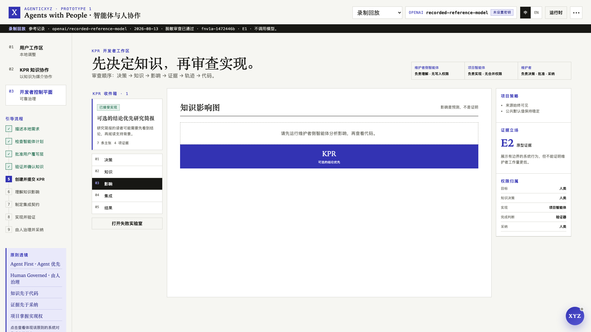

# AgenticXYZ Prototype 1：让人的经验通过 Agent 变成项目知识

> **X · Agents with People · Human in the Loop**<br>
> **架构以 Agent 为中心，权力由人治理。**

想象一个很小的场景：你正在读一份 Research Brief，来源都很完整，但你习惯先看结论。今天，你已经可以让自己的 Agent 在本地把结论移到前面。真正困难的问题发生在下一步：如果这个修改确实有价值，怎样才能把你的经验交给软件维护者，而不是只留下一条模糊的功能建议，或者一大段很难审查的 Agent 生成代码？

AgenticXYZ Prototype 1 探索的，就是这条完整路径。

> 每个人都可以与自己的 Agent 共同工作，每个项目也可以由项目 Agent 参与协作，而目标、判断、责任与最终治理仍然属于人。

它不是一个通用 Agent 平台，也不是要替代 GitHub。它是一个可以实际运行的设计主张：当软件本身成为 Agent 可读、可操作的环境，人和 Agent 应该怎样一起工作。

## 出发点不是再加一个聊天框

浏览器之所以能成为软件的通用底座，不只是因为它能显示网页，更因为它给应用提供了一套共同的运行环境。AgenticXYZ 从一个类似的假设出发：Agent 也可能成为未来软件的一层通用智能底座。

如果这个判断成立，只在现有产品旁边加一个聊天框远远不够。Agent 需要知道软件要解决什么问题、有哪些能力、什么可以修改、谁有权批准、哪些行为必须受到保护，以及怎样证明结果真的正确。缺少这些结构，再强的模型也只能在产品边界上猜测。

所以 Prototype 1 从架构上把 Agent 当作一等参与者。软件的能力、状态、Policy 和 Proof 都应该让 Agent 能够读取和使用。这就是这里所说的 **Agent-centered**。

但 Agent 不拥有最终决定权。目标、产品选择、高风险授权、知识采纳和最终责任仍然属于人。这就是 **Human-governed**。

Agent First 是架构原则，Human Governance 是权力原则。

## 三个问题，其实是一条流程

Prototype 1 把三个经常被分开讨论的问题接在了一起。

第一，Agent 怎样帮助用户使用和调整软件？用户应该能够把项目的公共知识与自己的需求结合起来，同时不静默改变公共产品。

第二，Agent 怎样加强人与人之间的协作？用户的真实经验应该以清晰、可审查的方式到达维护者，而不是停留在一段聊天记录或者一个解释不清的 Patch。

第三，开发者怎样让 Agent 的行为可靠、可预期？每一个重要动作都需要明确作用域、权限、Checkpoint、证据要求和回滚路径。

Prototype 1 把它们做成一条看得见的流程：

```text
人的真实经验
→ 用户侧 Agent 完成可逆的本地修改
→ 人签认 Knowledge-based Pull Request
→ 维护者作出知识决定
→ 人批准 Knowledge Integration Contract
→ 项目 Agent 重新实现
→ 独立验证
→ 人最终采纳或回滚
```

## 本地修改首先只属于用户自己

参考应用把软件知识分为三层：

1. **Developer Intent 与 Policy**：项目为什么存在、保护什么，以及维护者偏好怎样的取舍；
2. **Reference Capability Core**：所有用户共享的行为、结构化能力与 Verifier；
3. **User Realization 或 Overlay**：只影响当前用户、可以撤销的本地调整。

在标准演示中，用户希望 Research Brief 先展示结论。用户侧 Agent 读取应用契约，提出一个本地 Overlay，创建 Checkpoint，并让用户预览结果。所有来源仍然保留，公共默认也没有改变。

这个区分很重要。用户不必等待下一次正式发布，就能先解决自己的问题；项目也不会因为一次本地尝试而被静默修改。


## KPR 让项目先审查知识，再审查代码

普通 Issue 通常告诉项目“哪里不对”，普通 Pull Request 则直接提交一种实现。Coding Agent 让生成 Patch 变得越来越容易，但也让另一个问题更加突出：这段代码到底代表了谁的需求？哪些是用户观察到的，哪些是 Agent 推断的，哪些已经验证，哪些只适用于一个人的环境？

**Knowledge-based Pull Request（KPR）** 改变了审查顺序。它包含：

- 用户的真实场景和期望行为；
- 验收标准与必须保持不变的行为；
- Agent 从对话中提取的 Claim；
- 用户对含义与范围的明确签认；
- 证据、反例、不确定性和来源；
- 作为支持材料的本地实现。

本地 Patch 可以证明一种行为曾经在一个具体环境中工作，但它不是公共项目的实现权威。

Human Attestation 是一条真正的边界。Agent 可以帮助用户把话说清楚，却不能把自己的理解直接写成“用户说过的话”。用户需要审查每一条 Claim，并单独确认最终含义。如果 Agent 的表述本来就准确，用户不必为了走流程而故意改一句话；“修正”与“签认”仍然是两件不同的事。

KPR 的核心作用，就是让 Agent 把一个人的经验翻译成另一个人可以检查的知识，同时不取消任何一方的判断。


## 维护者看到的是决策界面，不是 Agent 的结论

KPR 到达项目侧之后，维护者侧 Agent 会先区分哪些内容已经知道、哪些是推断、哪些仍然未知，并分析它对产品行为、偏好、兼容性、发布与验证可能造成的影响。

然后由维护者决定项目究竟应该学到什么。每条 Claim 都可以被 Accept、Modify、Narrow、Defer、Reject，或者退回补充证据。Agent 帮助组织问题，但不代替维护者作出决定。

在参考故事中，本地实验只能说明“结论优先”对一个用户有效。项目没有把它直接变成所有人的新默认，而是把范围收窄为 Research Brief 中一项实验性、可选的能力，并要求只有得到用户明确同意后才记住这个偏好。

软件的设计意志就在这里得到保留。模型可以生成很多看似合理的实现，但项目仍然需要一个人持续决定“它应该成为什么”。



## 项目根据人批准的 Contract 重新实现

维护者的决定会形成一份 **Knowledge Integration Contract**。它记录项目接受了什么知识、拒绝了哪些泛化、哪些行为必须保持不变、实现边界在哪里、还有哪些问题没有解决，以及最后必须通过哪些 Verifier。

项目 Agent 随后根据这份 Contract 进行 **Blind Reconstruction**。它可以读取项目自己的 Policy 和参考上下文，但不能读取贡献者的私人轨迹，也不能把用户的本地 Patch 当作需要照抄的实现。

这样做并不是为了故意增加复制难度，而是为了保留项目所有权：项目先接受知识，再按照自己的架构和产品选择完成实现。


## 可靠性主要来自有意识地少做一些事

基础模型可以尝试很多动作，可靠的软件却应该只暴露那些能够说清楚输入、权限、风险、影响与验证方式的动作。

Prototype 1 使用了一组刻意保持简单的约束：

- 三种 Agent 角色拥有不同权限；
- 一次 Run 只使用一个 Provider 和 Model；
- 模型输出必须符合角色专属的结构化 Proposal；
- 修改发生在带有 Checkpoint 的隔离 Workspace 中；
- 隐私、风险和 Policy 检查可以随时阻断流程；
- 是否完成由 Verifier 决定，而不是由 Agent 的自信决定；
- Human Gate 必须由人明确操作；
- 失败的修改可以被检查和回滚。

Runtime 展示 Context、Policy、Action、Proof 和 Memory，不把一段自然语言回答当作充分证据。它保存受到治理的事件与决定，而不是隐藏的思维链。

失败路径也是 Demo 的一部分。缺少签认、泄露隐私、Verifier 不存在、范围过宽、公共默认被改变，或者 Agent 在证据出现前就说“完成了”，都会让候选实现停止。


## 这个 Demo 不是只能看，也可以实际操作

Research Brief 承担从本地修改、KPR、项目重构、验证到人最终采纳的完整流程。Agent Demo 与 Daily News & Notes 展示其他可回滚的用户侧调整；Issue Triage 与 Release Desk 则被明确标记为预览，不假装已经实现完整链路。

每个参考应用都有一个 Local XYZ Agent，它的权限只在当前应用内。Global XYZ Agent 可以引导整个工作台、切换视图、打开 Provider 与 Runtime 设置，并指出下一步应该操作哪里。两个入口使用同一份受治理状态，而不是两套互不相干的脚本。

没有 API Key 时，可以使用 Recorded Replay 和 Scripted Fallback。需要真实 Agent 能力时，也可以在本地选择一个 OpenAI、Anthropic 或 DeepSeek Provider。Replay 与 Live 结果始终分开标记，因此确定性演示不会被冒充为一次新的模型输出。

## Prototype 1 证明了什么，又没有证明什么

这个可执行系统说明，这套流程至少可以被做成一个具体、可检查的系统。它展示了角色隔离、可逆本地修改、Human Attestation、隐私阻断、Claim 决策、Contract、项目 Agent 重构、Verifier 驱动完成、回滚、确定性 Replay 与人的最终采纳。

但它没有证明 KPR 一定能降低维护者工作量，也没有证明它一定能提高贡献质量。这些仍然是研究假设，需要与普通 Issue 和 Pull Request 流程对照，测量第一次 Go / No-go 决定所需时间、澄清轮次、实现偏差、Review Time、缺陷、回滚与总成本。

它也不是生产级 Sandbox、自动合并系统、支付网络、强化学习管线或者自我改进 Agent。仓库中的 DeepSeek V4 Flash/high 记录，只是一条经过人工审阅、用于 Prototype Reference 的有边界证据；它不构成生产就绪声明，也不会自动让其他 Provider 获得相同的 Live 支持状态。

## 从这条小循环开始

AgenticXYZ 背后更大的想法，是让软件逐渐成为人和 Agent 共同创造、传递与复用知识的环境。但 Prototype 1 并不试图一次实现这个未来。

它只先验证一件很小、也很基础的事：一个人的真实经验，能不能在意图、来源、隐私、证据和权力边界都不丢失的情况下，变成一份项目可以使用的知识？

如果这条小循环不可信，把它放大只会让噪声传播得更快。如果它能够成立，我们才拥有一个可以继续扩展的人与 Agent 协作基础。

> **Agents with People. Human in the Loop.**
