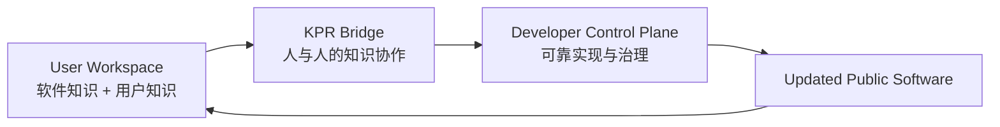
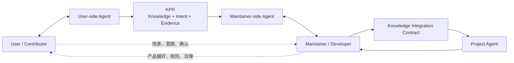
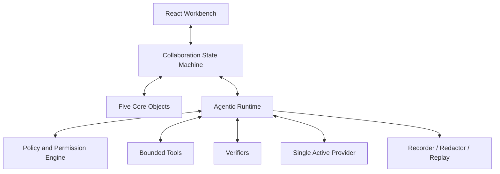

# AgenticXYZ Prototype 1 开发规范

> **Canonical title:** AgenticXYZ Prototype 1: Toward Agent–Human-Native Systems\
> **Axis:** X / Crossing\
> **Relationship:** Agents with People\
> **Human position:** Human in the Loop\
> **System principle:** Agent-centered, Human-governed\
> **Asset ID:** AXP-001\
> **Document status:** Development Specification / Working Baseline\
> **Evidence status:** E1 — System Hypothesis；实现并验收后可标记局部 E2 — Prototype Evidence\
> **Version:** 0.1\
> **Date:** 2026-08-13

---

## 0. 文档用途与规范词

本文档是 AgenticXYZ Prototype 1 的实现基线。它把当前已经确认的技术概念、产品观点、系统边界、数据对象、交互流程、运行机制和验收要求，转化为可以直接驱动开发的规范。

本文档不是：

- 对外宣传文章；
- 已完成能力说明；
- 研究论文或实验结论；
- 通用 Agent 平台设计；
- 生产级安全承诺。

本文档使用以下规范词：

- **MUST / 必须**：正式 Prototype 1 不满足该项即不能发布；
- **SHOULD / 应当**：默认必须实现，只有明确理由才可偏离；
- **MAY / 可以**：可选增强，不影响核心命题成立；
- **NON-GOAL / 非目标**：本代原型明确不承担的范围。

若未来实现与本文档冲突，必须先更新 `docs/decisions.md` 或本文档，再修改代码；不得通过代码事实倒逼概念悄然漂移。

---

## 1. 正式目标

### 1.1 North Star

Prototype 1 的正式目标是：

> **Prototype 1 探索这样一种协作形态：每个人都可以与自己的 Agent 共同工作，每个项目也可以由项目 Agent 参与协作，而目标、判断、责任与最终治理仍然属于人。**

最短表达：

> **Agents with People. Human in the Loop.**

系统权力原则：

> **Agent-centered, Human-governed.**

其中：

- `Agent-centered` 表示软件结构、能力接口、状态、知识和工作流从一开始就将 Agent 视为中心参与者；
- `Human-governed` 表示目标、价值判断、知识确认、高风险授权、公共产品决定、最终合并与责任仍然属于人；
- `Human in the Loop` 是固定治理术语，不因“Agent 始终在前”的品牌语言规则而改写。

### 1.2 Prototype 1 要回答的问题

Prototype 1 需要给出一个可运行的系统回答：

> 当用户拥有用户侧 Agent、项目拥有项目 Agent，Agent 同时进入人与人协作的两端时，软件知识、用户知识、贡献知识、实现知识与治理责任应如何被组织？

### 1.3 核心价值主张

Prototype 1 的统一主张是：

> **Agentic Software 让 Agent 将软件知识与用户知识结合；KPR 让 Agent 加强人与人之间的知识协作；Agentic Runtime 让开发者把经过治理的知识转化为可控、可验证的软件行为。**

英文工作版本：

> **Agentic Software helps agents combine software knowledge with user knowledge. KPR helps agents strengthen knowledge collaboration between people. Agentic Runtime helps developers turn governed knowledge into controlled and verifiable software behavior.**

贯穿 Demo 的过程性表达：

> **Agents turn human experience into reviewable knowledge, and compile human-governed knowledge into verified software.**

### 1.4 定位

Prototype 1 是：

- 一篇系统观点文章的可执行补充材料；
- 一次关于下一阶段 Agent 协作形态的系统级提案；
- 一个可运行、可检查、可讨论的 Conceptual Prototype；
- 面向 Agent 研究者、高级开发者、技术负责人和开源维护者的公共知识资产。

Prototype 1 不是：

- 一个要替代 GitHub 的完整产品；
- 一个通用 Coding Agent；
- 一个多模型竞技场；
- 一个面向终端用户的成熟 SaaS；
- 一个声称已经降低真实维护成本的实证结论。

Prototype 1 必须建立为全新的独立项目。既有 Job Talk 与旧 Demo 只作为概念历史和设计参考，不默认复制其代码、截图、文案或发布资产。可以继承经过重新确认的思想，但每项实现都必须在本规范下重新定义、重新验证。

### 1.5 成功的最小定义

Prototype 1 成功，不是因为界面完整或 Agent 能生成代码，而是因为目标读者可以通过文章、截图和 Demo 准确理解并亲自观察：

1. 用户侧 Agent 如何把模糊需求转化为本地可验证修改；
2. 用户如何确认 Agent 提取的知识，而不是被 Agent 代表；
3. KPR 如何把贡献对象从代码 Diff 扩展为知识、意图和证据；
4. Maintainer-side Agent 如何帮助维护者理解 KPR 和影响范围；
5. Maintainer 如何调整知识进入公共项目的形式；
6. 项目 Agent 如何根据项目自己的规则重新实现；
7. Runtime 如何通过权限、验证、恢复和审计建立可信度；
8. 最终目标、判断、责任与治理如何保持在人手中。

### 1.6 上层愿景与 Prototype 边界

Prototype 1 来自一个更大的系统假设：

> 如果 Agent 将来会像浏览器运行时或应用平台一样，成为许多软件的默认智能底座，那么软件就不应把 Agent 当成外挂聊天框，而应从知识、能力、状态、权限、验证和治理层原生地容纳 Agent。

这一假设在 Prototype 1 中形成四个上层约束：

1. **软件是可执行的知识形态。** 代码只是知识的实现之一；产品目标、领域概念、用户场景、行为边界、测试、文档和历史决策同样属于软件知识。
2. **软件是数字化的真实场景。** 每个垂直软件都提供具体任务、约束、反馈和评价环境；Agent 基础设施不需要直接取代所有垂直软件开发。
3. **软件仍然需要主理人与偏好。** 基础模型能够提出许多可能实现，但软件的价值来自对目标用户、行为边界、默认值和取舍的持续选择。Project Policy 必须把这种设计意志变成 Agent 可读取的治理规则。
4. **Agent 扩大参与，不取消责任。** 用户可以成为软件共建者，Agent 可以承担更多理解和执行工作，但贡献确认、公共产品判断和最终责任不能被概率模型吸收。

整体生态有三个层级：

| 生态层级 | 提供 | 获得 |
|---|---|---|
| Agent / Model / Runtime 开发者 | 通用智能、可靠运行、权限与验证机制 | 真实软件场景、能力反馈、评价信号 |
| 应用开发者与软件主理人 | 领域知识、产品偏好、数字化任务环境 | Agent 能力、用户知识贡献、开发与治理辅助 |
| 最终用户与共建者 | 真实需求、个体知识、使用反馈和贡献意图 | 更易使用、可本地适配且可参与建设的软件 |

Prototype 1 只实现这套 Big Picture 中的 X：

> **X / Crossing / Agents with People / Human in the Loop.**

它聚焦人在 Agent 帮助下如何使用软件、调整软件、交换知识并治理公共实现。Usage Attribution、应用作为智能分发节点、Token 收益分享，以及将真实场景沉淀为 Eval 或后训练材料，均可在文章中作为生态演化方向讨论，但不是 Prototype 1 的实现或证据主张。

---

## 2. 系统总览

### 2.1 三大系统部分

| 系统部分 | 核心问题 | 核心机制 | 主要可见产物 |
|---|---|---|---|
| **Agentic Software** | Agent 如何帮助用户将自己的知识融入软件？ | Agent-friendly Software Contract + User Overlay | 用户侧修改、预览、验证、回滚 |
| **KPR** | Agent 如何加强用户与开发者之间的知识协作？ | Knowledge-based Pull Request + Knowledge Review | KPR、Knowledge Diff、Impact Map、Integration Contract |
| **Agentic Runtime** | 开发者如何让 Agent 行为可靠、可控、可验证？ | Policy + Permission + Verification + Recovery | Plan、Tool Calls、Evidence、Checkpoint、Audit |

三个部分的短表达：

> **Adapt locally. Collaborate through knowledge. Govern reliably.**

### 2.2 统一端到端流程



完整知识流：

```text
Human Experience
→ User-side Agent Local Exploration
→ Human-attested KPR
→ Maintainer-side Agent Understanding
→ Knowledge Impact Analysis
→ Maintainer Knowledge Shaping
→ Knowledge Integration Contract
→ Project Agent Implementation
→ Behavior + Knowledge + Evidence Review
→ Human Governance
→ Verified Code Merge
```

### 2.3 五个正式参与者



#### User / Contributor

负责：

- 提供真实场景；
- 表达需求和不满；
- 使用、纠正和验证本地修改；
- 确认 Agent 总结是否准确；
- 清理隐私与不相关信息；
- 对问题描述、复现和自己声称验证过的内容负责。

#### User-side Agent

负责：

- 理解用户意图；
- 读取 Agentic Software Contract；
- 在本地 Change Workspace 中形成候选修改；
- 运行允许的 Verifier；
- 记录成功、失败、纠正和证据；
- 将过程整理为结构化 KPR 草案；
- 请求用户完成 Human Attestation。

不得：

- 将自己的推断冒充用户确认；
- 默认取得公共项目实现权；
- 未经确认提交包含隐私、秘密或不明许可材料的内容；
- 直接修改公共项目的权威状态。

#### Maintainer / Developer

负责：

- 判断问题是否值得公共项目解决；
- 审查贡献知识、影响范围和证据；
- 调整功能形态、适用范围、默认值和上线边界；
- 决定是否进入 Project Agent Synthesis；
- 审查行为、知识、证据和必要的代码；
- 对公共项目最终决定与合并负责。

#### Maintainer-side Agent

负责：

- 将 KPR 整理为 30-second Decision Brief；
- 区分贡献者明确表达、Agent 提取、项目推断与未知事项；
- 生成 Knowledge Diff、Knowledge Impact Analysis 和待决问题；
- 将 Claim、Evidence、Policy 和潜在影响建立可检查的联系；
- 帮助 Maintainer 比较 `Accept / Modify / Narrow / Defer / Reject / Request Evidence`；
- 根据 Maintainer 的实际决定起草 Knowledge Integration Contract。

不得：

- 将自己的项目侧推断写回为“用户要求”；
- 代替 Maintainer 接受知识、改变产品范围或批准 Contract；
- 修改公共项目实现；
- 把信息摘要或影响预测冒充已经验证的事实。

#### Project Agent

负责：

- 在项目上下文中解释被批准的知识；
- 读取 Project Policy、架构、代码和测试；
- 根据 Knowledge Integration Contract 生成候选实现；
- 运行项目侧 Verifier；
- 报告冲突、不确定性、失败和偏差；
- 在 Runtime 约束下修订、停止或请求升级。

不得：

- 默认读取未经许可的用户侧完整轨迹和代码；
- 把 KPR 中未被 Maintainer 接受的内容视为项目要求；
- 自行更改公共产品目标、Policy 或最终验收标准；
- 将“生成完成”视为验证完成。

三个 Agent 角色必须保持明确隔离：

- User-side Agent 代表贡献者探索和表达本地知识；
- Maintainer-side Agent 帮助 Maintainer 理解、质疑和塑造公共知识；
- Project Agent 只把已经治理的 Contract 转化为项目候选实现。

它们可以使用同一 Active Provider 和 Model，但不得共享未经授权的上下文、工具或权限。

### 2.4 三种协作关系

1. **Agent ↔ Person**：人提供目标、知识、纠正与治理；Agent 负责解释、执行、验证和组织信息。
2. **Person ↔ Person through Agents**：用户与开发者通过双方 Agent 交换经过确认的知识，而不是只交换反馈、原始聊天或代码。
3. **Agent ↔ Agent under Human Governance**：不同 Agent 通过 KPR、Manifest、Contract 和 Evidence 协作，但权限、上下文和实现权保持隔离。

---

## 3. 系统原则

所有实现与界面决策必须服从以下原则。

### P1. Agent First

- 每个核心能力必须有机器可读接口；
- Agent 不依赖模拟点击传统 UI 才能理解和调用软件；
- 状态、能力、约束、验证器和影响范围应可被 Agent 读取；
- Agent 与人操作同一份任务和知识状态，而不是另有一套隐藏世界。

### P2. Human Governed

- 人定义目标、Non-goals、风险边界和最终验收；
- 人的批准、拒绝、纠正和范围调整必须成为持久状态；
- Agent 的能力不自动转化为权力；
- 项目 Agent 不是责任主体。

### P3. Knowledge before Code

- 首次审查先判断问题、行为、边界和证据；
- 代码是知识的一次实现，不等同于知识本身；
- 外部实现是证据，不自动拥有 Implementation Authority；
- 项目侧在自己的约束下生成或修订候选实现。

### P4. Evidence before Adoption

- 没有证据的流畅总结不能升级为项目知识；
- 每项 Knowledge Claim 必须显示来源、范围、确认状态和证据；
- Agent 输出“完成”不能替代 Verifier；
- Evidence 必须说明支持了哪项知识，而不是只显示“测试通过”。

### P5. Progressive Disclosure

默认信息顺序：

```text
Decision
→ Knowledge
→ Impact
→ Evidence
→ Trace
→ Code
```

不得默认用代码 Diff、完整聊天或长轨迹淹没 Maintainer。

### P6. Uncertainty is Visible

- Agent 推断必须与人类确认分离；
- 冲突、未知、适用范围和证据缺口必须优先显示；
- UI 不得只展示成功路径；
- 系统必须提供 `Needs More Knowledge`、`Reject`、`Revise` 和 `Rollback`。

### P7. Bounded, Inspectable, Verifiable, Reversible

Prototype 1 不承诺概率模型输出完全一致。“可预测”在本文中定义为：

- 能力范围可知；
- 影响边界可预览；
- 执行过程可观察；
- 结果可独立验证；
- 失败可停止、升级或撤销；
- 责任与来源可追踪。

### P8. One Active Provider

- 一次运行只允许一个 Active Provider 和一个 Active Model；
- User-side Agent、Maintainer-side Agent 与 Project Agent 共用同一 Provider 和模型；
- 三者差异必须来自角色、上下文、Policy、工具和权限，而不是模型切换；
- Prototype 1 不展示多 Provider 并行或模型对比。

### P9. Claim–Evidence Separation

- 设计文章可以提出系统假设；
- Live Demo 可以产生 E2 Prototype Evidence；
- 不得据此宣称已经降低真实开源维护成本；
- 认知负担、审查效率和缺陷率需要未来单独研究或 Field Study。

---

## 4. Agentic Software 规范

### 4.1 定义

Agentic Software 不是传统软件附加聊天框，而是：

> **从一开始就为 Agent 与人共同理解、操作、调整和治理而设计的软件。**

Prototype 1 不声称成为“所有软件的通用底座”，但必须提出并实现一个足够小的 Agentic Software Contract，展示其他软件可以如何采用这种组织方式。

### 4.2 软件的三层知识

#### Layer 1 — Developer Intent

开发者对软件的预设知识：

- Problem definition；
- Product preferences；
- Design principles；
- Business rules；
- Safety and privacy boundaries；
- Protected invariants；
- Default behavior；
- Mutable surfaces；
- Acceptance and rejection rules。

主要载体：`ProjectPolicy`。

#### Layer 2 — Reference Capability Core

开发者提供的标准、可执行实现：

- 数据结构；
- Capability Schema；
- 默认业务逻辑；
- 默认界面；
- Reference Workflows；
- 权限模型；
- 测试与 Verifier；
- 恢复默认所需的基线；
- 版本和兼容性声明。

主要载体：`ProjectManifest`、reference files、tests 和 verifiers。

#### Layer 3 — User Realization / Overlay

软件在某个用户环境中的真实形态：

- 用户偏好；
- 个性化呈现；
- 本地 Workflow；
- 用户组合的能力；
- 本地扩展；
- 与用户私人知识相关的状态；
- Agent 根据用户需求形成、经过批准的修改。

主要载体：`ChangeWorkspace.userOverlay`。

三层关系：

```text
Developer Intent
        +
Reference Capability Core
        +
User Knowledge
        ↓
User-specific Software Realization
```

### 4.3 写入规则

- User-side Agent 默认只能写入 Layer 3；
- Layer 1 和 Layer 2 默认只读；
- 对公共能力的建议必须通过 KPR；
- `Restore Default` 必须能够丢弃 User Overlay 并恢复 Reference Core；
- User Overlay 必须有来源、版本、确认状态和回滚点；
- 私人 Overlay 不得自动进入公共 KPR；
- 导出 KPR 前必须进行范围选择和隐私清理。

### 4.4 Agent-friendly Software Contract

Reference Application 必须至少暴露：

```text
agentic.manifest.json
project-policy.yaml
capabilities.schema.json
state.schema.json
mutable-surfaces.json
verifiers/
reference/
user-overlay/
```

#### `agentic.manifest.json`

必须声明：

- project identity and version；
- supported capabilities；
- mutable surfaces；
- protected invariants；
- risk levels；
- approval rules；
- verifiers；
- KPR schema version；
- default provider-independent Agent roles。

#### Capability 定义

每项 Capability 必须包括：

- stable ID；
- human-readable name；
- purpose；
- input and output schema；
- side effects；
- permission level；
- risk level；
- reversibility；
- examples；
- success verifier；
- failure modes；
- whether human approval is required。

#### Mutable Surface

可修改面分为：

- `resource`：数据、内容、素材和外部来源；
- `logic`：工作流、规则和能力组合；
- `interface`：布局、呈现和交互；
- `preference`：用户级偏好和默认选择。

每个 Surface 必须声明：

- `protected`：Agent 不得修改；
- `user-local`：只可写入个人 Overlay；
- `project-configurable`：项目可调整；
- `contributable`：本地验证后可进入 KPR；
- `reversible`：是否存在可靠回滚路径。

### 4.5 用户侧修改流程

```text
User Intent
→ Intent Object
→ Read Manifest and Policy
→ Identify Mutable Surfaces
→ Predict Impact
→ Propose Local Change
→ Human Approval
→ Apply to User Overlay
→ Run Verifiers
→ Accept / Revise / Rollback
→ Optional KPR
```

### 4.6 用户侧必须可见的内容

User Workspace 必须展示：

- 当前公共核心版本；
- 当前 User Overlay；
- Agent 计划修改什么；
- 为什么该修改被允许；
- 哪些部分受到保护；
- Before / After；
- 验证结果；
- Undo 和 Restore Default；
- 哪些内容将进入 KPR，哪些保持私人。

---

## 5. KPR 规范

### 5.1 定义

`Knowledge-based Pull Request (KPR)` 是一种 Agent 时代的知识贡献和协作协议：

> 用户侧提交经过真实场景、本地探索、人工确认和证据支持的知识；项目侧先治理知识，再由项目 Agent 在项目自己的上下文和规范下生成候选实现。

KPR 不取消代码、测试或审查。它改变的是：

- 外部贡献的首要对象；
- 信息呈现顺序；
- 实现权所在；
- Human 与 Agent 的协作边界。

### 5.2 KPR 的非目标

KPR 不是：

- 更长的 Issue Template；
- 自动生成的 PR 描述；
- 原始聊天全文；
- 自动可信的 Spec；
- 对所有小型改动的强制替代；
- 取消代码审查；
- 取消 Maintainer 责任。

### 5.3 最小 KPR 内容

KPR 必须包括：

1. `Problem & Scope`；
2. `Expected Behavior`；
3. `Acceptance Criteria`；
4. `Non-goals`；
5. `Protected Invariants`；
6. `Knowledge Claims`；
7. `Evidence`；
8. `Decision Record`；
9. `Failed Attempts / Counterexamples`；
10. `Open Questions`；
11. `Provenance`；
12. `Privacy and License Status`；
13. `Human Attestation`；
14. `Local Implementation Reference`（可选、默认不交给 Project Agent）；
15. `Knowledge Impact Analysis`（项目侧生成）；
16. `Knowledge Integration Contract`（Maintainer 决策后生成）。

### 5.4 KnowledgeClaim

`KnowledgeClaim` 是 KPR 的最小知识单元。

```ts
type KnowledgeClaimType =
  | "problem"
  | "intent"
  | "expected_behavior"
  | "constraint"
  | "acceptance_criterion"
  | "invariant"
  | "decision"
  | "evidence_interpretation"
  | "counterexample"
  | "open_question";

interface KnowledgeClaim {
  id: string;
  type: KnowledgeClaimType;
  statement: string;
  scope: string[];
  createdBy: ActorRef;
  derivedFrom: SourceRef[];
  agentGenerated: boolean;
  humanAttestation?: HumanAttestation;
  evidenceRefs: string[];
  confidence: "low" | "medium" | "high";
  status:
    | "captured"
    | "agent_extracted"
    | "human_attested"
    | "project_reviewed"
    | "accepted_for_synthesis"
    | "verified"
    | "adopted"
    | "rejected"
    | "superseded";
  conflictsWith: string[];
  supersedes: string[];
  limitations: string[];
}
```

### 5.5 来源与确认必须分离

UI 和数据模型必须区分：

- `Human-authored`：人直接提出；
- `Agent-extracted`：Agent 从交互或制品中总结；
- `Human-corrected`：人显式修订 Agent 提取的表述，并保留修订前后与来源；
- `Human-attested`：人确认 Agent 总结没有歪曲意图；
- `Project-inferred`：Maintainer-side Agent 根据项目上下文推断；
- `Maintainer-confirmed`：Maintainer 接受或修订；
- `Verifier-supported`：有明确测试或环境证据支持。

不得把 `createdBy = agent` 且没有 Human Attestation 的内容显示为“用户要求”。Canonical Flow 必须要求贡献者显式审阅 Agent-extracted Claims，并通过独立动作完成 Attestation；只有在表述确需修订时才进行 Claim correction。修正需要保留前后文本与溯源，但不是 Attestation 的前置条件，Agent 也不得替人签认。

### 5.6 KPR 状态机

```text
Draft
→ Contributor Review
→ Submitted
→ Knowledge Gate
   ├── Needs More Knowledge
   ├── Rejected
   └── Accepted for Synthesis
→ Project Agent Synthesis
→ Verification
   ├── Revision Required
   ├── Rolled Back
   └── Verification Passed
→ Maintainer Review
→ Adopted / Rejected / Deferred
```

### 5.7 Knowledge Gate

进入 Project Agent Synthesis 前，必须检查：

- Human Attestation 是否存在；
- 问题和范围是否明确；
- Expected Behavior 是否可观察；
- Acceptance Criteria 是否可验证；
- Invariants 是否声明；
- 证据是否支持相应 Claim；
- 是否存在隐私、秘密和许可问题；
- 是否与 Project Policy 冲突；
- 是否存在明显重复 KPR；
- 是否还有阻塞性的 Open Question。

### 5.8 Knowledge Impact Analysis

Maintainer-side Agent 必须在写代码前生成 Knowledge Impact Analysis。

影响维度至少包括：

- Product Behavior；
- Interface；
- User Preference；
- Data and Provenance；
- Permissions and Privacy；
- Compatibility；
- Performance and Cost；
- Verification；
- Documentation；
- Rollout and Rollback。

每项影响必须标记：

- `explicit`：KPR 明确提出；
- `agent-inferred`：Maintainer-side Agent 推断；
- `policy-required`：Project Policy 要求；
- `maintainer-confirmed`：Maintainer 已确认；
- `unknown`：尚不能确定。

每项推断还必须显示：

- 依据；
- 置信度；
- 潜在受影响对象；
- 是否需要人决定；
- 是否需要额外证据。

### 5.9 Maintainer Knowledge Shaping

Maintainer 必须能够对每项 Knowledge Claim 执行：

- `Accept`；
- `Modify`；
- `Narrow`；
- `Defer`；
- `Reject`；
- `Request Evidence`。

Maintainer 必须能够调整：

- 适用场景；
- 影响用户；
- 默认功能、可选功能或私人能力；
- 目标模块和 Capability；
- 数据读取与写入范围；
- 不变量；
- 上线阶段；
- 验证要求；
- 回滚条件；
- 是否允许 Project Agent 查看用户侧局部实现证据。

### 5.10 Knowledge Integration Contract

Knowledge Integration Contract 是 KPR 经过 Maintainer 治理后的项目侧决议，不是第六个顶层核心对象。

```ts
interface ClaimResolution {
  claimId: string;
  decision: "accept" | "modify" | "narrow" | "defer" | "reject" | "request_evidence";
  finalStatement?: string;
  rationale: string;
  targetScopes: string[];
  rollout?: string;
  requiredVerifierIds: string[];
}

interface KnowledgeIntegrationContract {
  kprId: string;
  acceptedKnowledge: ClaimResolution[];
  rejectedKnowledge: ClaimResolution[];
  protectedInvariants: string[];
  implementationBoundary: string[];
  requiredVerifiers: string[];
  unresolvedQuestions: string[];
  approvedBy: ActorRef;
  approvedAt: string;
}
```

Project Agent 只能将 Contract 中被接受或修改后接受的知识视为实现要求。

`requiredVerifierIds` 必须引用 Reference Application 已注册的项目侧 Verifier，不能复用本地 Evidence ID。Project Policy 的强制 Verifier 构成不可由 Maintainer 静默删除的安全下限；Claim Resolution 可以建立更细的 Claim-to-Proof 关联。若出现未注册 Verifier，Contract 必须保留该问题并阻断 Project Agent Synthesis。

### 5.11 Blind Reconstruction

默认模式必须是：

> **Project Agent 不读取用户侧完整代码 Patch，只根据经过确认的 KPR、Project Policy 和 Integration Contract 重新实现。**

高级模式可以允许 `Evidence-assisted Reconstruction`，但必须：

- 由 Maintainer 显式开启；
- 只暴露经过许可的局部证据；
- 标记许可与来源；
- 在 Run Trace 中记录。

---

## 6. KPR Developer Workspace 规范

### 6.1 目标

传统代码 PR 迫使开发者从说明文字、代码 Diff 和 CI 中反向推断问题、意图和边界。KPR Developer Workspace 的目标是重新安排信息顺序，帮助 Maintainer 先回答：

1. 这个问题是否真实且值得公共项目解决？
2. 期望行为是否与项目知识和产品原则一致？
3. 证据是否足以开始项目侧实现？
4. 若进入项目，应以什么形式、范围和默认值进入？

### 6.2 四阶段审查

#### Stage 1 — Understand

展示：

- 30-second Decision Brief；
- 用户真实问题；
- 本地探索摘要；
- Human Attestation；
- 已验证内容；
- 冲突与未知。

当前唯一主要决定：

> 是否值得进入深入 Knowledge Review？

#### Stage 2 — Impact and Shape

展示：

- Knowledge Diff；
- Knowledge Provenance；
- Knowledge Impact Map；
- Project Policy 冲突；
- Open Questions；
- Claim Resolution Controls。

当前主要决定：

> 哪些知识以什么范围进入项目？

#### Stage 3 — Synthesize and Verify

展示：

- Knowledge Integration Contract；
- Project Agent Plan；
- Predicted Impact；
- Runtime Tool Calls；
- Behavioral Diff；
- Knowledge Diff；
- Evidence Diff；
- Verification Results。

当前主要决定：

> 候选实现是否准确实现了已经批准的知识？

#### Stage 4 — Govern

展示：

- 最终行为；
- 采纳、修改、拒绝和保留开放的知识；
- Verifier 覆盖；
- 残余风险；
- 可选 Code Inspection；
- Rollback Plan。

当前主要决定：

> Adopt、Revise、Reject，还是保留为 User-local Capability？

### 6.3 30-second Decision Brief

必须在首屏显示：

- 一句话 Decision；
- Why now；
- Value；
- Scope；
- Risk；
- Evidence count；
- Policy conflicts；
- Open questions；
- 当前需要 Maintainer 做出的唯一决定。

首屏不得默认显示：

- 完整代码 Diff；
- 完整 Agent 对话；
- 完整 Tool Trace；
- 大段未经分解的 KPR 正文。

### 6.4 Knowledge Diff

Knowledge Diff 至少分为：

- `New Knowledge`；
- `Changed Assumptions`；
- `Preserved Invariants`；
- `Conflicts`；
- `Unknowns`；
- `Rejected or Superseded Knowledge`。

### 6.5 Knowledge Provenance

每项 Claim 的默认卡片必须显示：

- statement；
- type；
- created by；
- derived from；
- Human Attestation；
- evidence count；
- applicable scope；
- confidence；
- current review status。

### 6.6 Evidence Sidebar

Evidence 不是独立堆放。点击 Claim 时，只展示支持或反驳该 Claim 的证据。

每项 Evidence 必须回答：

- 它是什么；
- 谁或什么产生；
- 它支持哪个 Claim；
- 它不能证明什么；
- 是否可以重放；
- 是否经过人确认；
- 是否包含隐私或许可限制。

### 6.7 Behavioral / Knowledge / Evidence Diff

项目侧实现完成后，默认审查顺序必须是：

1. **Behavioral Diff**：用户可观察行为如何变化；
2. **Knowledge Diff**：哪些贡献知识被采纳、修改、缩小或拒绝；
3. **Evidence Diff**：新增了哪些证据，哪些风险仍未覆盖；
4. **Code Diff**：按需展开的实现细节。

### 6.8 认知负担设计原则

- 每个 Stage 只突出一个主要决定；
- 默认摘要不超过 5 个主要要点；
- 任何 Agent 总结都必须可追溯到来源；
- 冲突和未知不得藏在折叠区域；
- 原始轨迹与代码采用 Progressive Disclosure；
- 不用单一颜色表达来源或状态；
- 图谱只展示当前 Decision 所需子图，避免“巨大知识图”制造新负担。

---

## 7. Agentic Runtime 规范

### 7.1 定义

Agentic Runtime 是将概率模型能力转化为受调度、受权限限制、可观察、可验证和可恢复系统行为的控制层。

模型负责提出或选择动作；Runtime 负责决定动作能否执行、如何执行、如何验证和何时升级给人。

### 7.2 单 Provider 配置

一次 Run 只配置：

```text
Provider: OpenAI | Anthropic | DeepSeek
Model: <provider model id>
API Key: environment or session memory
```

要求：

- User-side Agent、Maintainer-side Agent 与 Project Agent 共用 Active Provider 和 Active Model；
- 不允许在一个 Run 内为三个角色配置不同 Provider；
- 不做 Provider 排名或输出对比；
- 模型 ID 不硬编码进协议；
- Provider 不得影响 KPR Schema 和核心状态机。

### 7.3 Provider Driver

```ts
interface ModelProvider {
  id: "openai" | "anthropic" | "deepseek";
  runTurn(request: AgentRequest): Promise<AgentResponse>;
  streamTurn?(request: AgentRequest): AsyncIterable<AgentEvent>;
}
```

三类 Driver：

- OpenAI：Responses API / Function Calling；
- Anthropic：Messages API / Tool Use；
- DeepSeek：OpenAI-compatible Chat Completions / Tool Calls。

Prototype 1 以一次真实、角色绑定的结构化 Proposal 请求作为 Connection Evidence，不额外发起一个只验证凭证的计费探针。`/api/health` 只报告本地配置是否存在，不冒充远端连接成功；正式支持状态必须来自 Live Smoke 的真实角色请求。

统一输出事件：

```text
assistant_message
tool_call
tool_result
usage
stop_reason
refusal
provider_error
```

### 7.4 角色隔离

相同 Provider 下，三个 Agent 的差异由以下内容产生：

| 维度 | User-side Agent | Maintainer-side Agent | Project Agent |
|---|---|---|---|
| Role | 用户知识探索者和表达者 | 维护者的知识审查助手 | 项目知识实现者 |
| Context | 用户场景、本地 Workspace、用户确认 | KPR、Evidence、Policy、Maintainer 决策 | Contract、Project Policy、项目代码 |
| Tools | 本地 Overlay、用户侧 Verifier、KPR Builder | Impact、Claim Resolution、Contract Draft | 项目 Workspace、项目测试、实现工具 |
| Authority | 无公共实现权 | 无知识批准权和代码写入权 | 无产品决策权和最终合并权 |
| Human gate | Contributor Attestation | Maintainer Claim Resolution | Maintainer-approved Contract 与最终审查 |

#### Harness 的五个观察面

开发者视窗必须能够把一次 Agent Run 投影为五个可检查的观察面：

| 观察面 | 回答的问题 | Prototype 1 中的载体 |
|---|---|---|
| `Context` | Agent 看到了什么，又明确没有看到什么？ | Role、Manifest、Policy、KPR、Contract、Workspace Scope |
| `Policy` | 哪些行为被允许、拒绝或需要人批准？ | Policy Rule、Permission、Risk Level、Human Gate |
| `Action` | Agent 实际提出和执行了什么？ | Structured Tool Call、Tool Result、Workspace Change |
| `Proof` | 什么证据支持成功、失败或保持不变？ | Verifier、Acceptance Result、Invariant Check、Evidence Link |
| `Memory` | 哪些经过治理的信息会影响未来 Run？ | Attested Preference、Decision、Checkpoint、Run Summary |

这里的 `Memory` 不保存模型隐藏推理，也不等于自动学习。只有经过范围声明、来源记录和相应 Human Gate 的偏好、决策和事实才能进入持久状态。

#### Skills

Skill 是角色绑定、可版本化的复用工作流，不是第六个核心对象。一个 Skill 至少声明：

```ts
interface SkillDefinition {
  id: string;
  version: string;
  role: "user-side" | "maintainer-side" | "project";
  purpose: string;
  inputSchema: JsonSchema;
  outputSchema: JsonSchema;
  allowedToolIds: string[];
  requiredHumanGates: string[];
  requiredVerifierIds: string[];
  budget: RunBudget;
}
```

Prototype 1 的参考 Skills：

- User-side：`adapt_software_locally`、`describe_to_kpr`；
- Maintainer-side：`understand_kpr`、`analyze_knowledge_impact`、`draft_integration_contract`；
- Project：`implement_from_contract`、`verify_candidate`。

约束：

- Skill 只组合已有受控工具，不能扩大角色权限；
- Skill 运行必须写入 `AgentRun`；
- Skill 失败、纠正和验证结果必须可见；
- Prototype 1 不允许 Skill 自动改写自身或自动内化进模型；
- Trajectory、Skill 演化和模型后训练的闭环属于 Future Work。

### 7.5 Runtime Loop

```text
Context Assembly
→ Model Planning
→ Structured Tool Call
→ Schema Validation
→ Policy and Permission Check
→ Proposal Boundary
→ Human Approval when required
→ Application State Transition
→ Verifier / Environment Result
→ Revise / Stop / Govern
→ Human Governance
```

每个 Provider Turn 在一个角色专属的结构化 Proposal 处结束。应用负责执行状态转换和 Verifier；Prototype 1 不把 Tool Result 再发送给模型形成隐藏的自主循环。重新调用模型必须成为新的、可见的 `AgentRun`，旧 Run 保留在 append-only 审计历史中。

### 7.6 工具集合

Prototype 1 的最小工具：

#### Read tools

- `read_project_manifest`
- `read_project_policy`
- `inspect_workspace`
- `read_knowledge_claim`
- `read_evidence`
- `read_integration_contract`

#### Knowledge tools

- `propose_knowledge_claims`
- `link_evidence_to_claim`
- `request_human_attestation`
- `build_kpr`
- `analyze_knowledge_impact`
- `propose_claim_resolution`

#### Change tools

- `propose_change`
- `preview_workspace_patch`
- `apply_workspace_patch`
- `create_checkpoint`
- `rollback_change`

#### Verification tools

- `run_verifier`
- `compare_behavior`
- `check_policy_compliance`
- `check_secret_and_privacy`

#### Governance tools

- `request_human_approval`
- `submit_kpr`
- `accept_for_synthesis`
- `request_more_knowledge`
- `reject_kpr`

所有工具必须：

- 使用结构化输入；
- 执行前通过 Schema Validation；
- 声明风险和副作用；
- 由应用而不是模型执行；
- 返回结构化 Tool Result；
- 写入 AgentRun；
- 不允许任意 Shell 或不受限文件系统访问。

### 7.7 风险等级

| Level | 行为 | 默认策略 |
|---|---|---|
| R0 | 读取 Manifest、Policy、静态分析 | 自动允许 |
| R1 | 可逆的 User Overlay 修改 | 预览后允许或按策略批准 |
| R2 | 执行测试、网络 API、项目 Workspace 修改 | 条件允许，必要时 Human Approval |
| R3 | 公共状态、凭证、不可逆外部行为、最终合并 | 必须 Human Approval |

Prototype 1 不执行真实生产部署；R3 主要用于展示治理边界。

### 7.8 可靠性机制

必须实现：

- typed tools；
- least privilege；
- Plan Preview；
- predicted impact；
- Policy Engine；
- budgets；
- timeouts；
- max tool calls；
- checkpoints；
- verifier-driven completion；
- retry limits；
- rollback；
- ask / escalate / abstain；
- append-only event log；
- secret redaction；
- explicit termination reason。

实现说明（D-020）：Runtime 保留可配置 timeout 与对应 Contract Test；默认 `AGENTICXYZ_REQUEST_TIMEOUT_MS=0` 时不以本地固定时限中断 high-effort Provider，而是等待完整响应或由人主动取消。Provider 调用次数、Tool 调用次数与 Token 上限仍然受控。

### 7.9 Completion Rule

Agent 不能通过自然语言声明 `done` 完成任务。任务完成至少要求：

- required Verifier 全部运行；
- Acceptance Criteria 有明确结果；
- Protected Invariants 未被破坏；
- Policy Compliance 通过或有经人批准的例外；
- Open Questions 不包含阻塞项；
- 对应 Human Gate 已完成。

---

## 8. 五个核心对象

Prototype 1 只保留五个顶层核心对象。其他视图和文档必须由它们派生。

### 8.1 ProjectManifest

回答：这是什么项目、Agent 能做什么、谁能决定什么。

```ts
interface ProjectManifest {
  schemaVersion: "0.1.0";
  projectId: string;
  projectVersion: string;
  name: string;
  description: string;
  knowledgeLayers: KnowledgeLayer[];
  capabilities: CapabilityDefinition[];
  mutableSurfaces: MutableSurfaceDefinition[];
  protectedInvariants: string[];
  verifierIds: string[];
  riskPolicyVersion: string;
  kprSchemaVersion: string;
}
```

### 8.2 ProjectPolicy

回答：软件主理人希望软件怎样工作、哪些边界不能被破坏。

```ts
interface ProjectPolicy {
  schemaVersion: "0.1.0";
  projectId: string;
  productPrinciples: PolicyRule[];
  safetyRules: PolicyRule[];
  privacyRules: PolicyRule[];
  contributionRules: PolicyRule[];
  runtimeRules: PolicyRule[];
  approvalRules: ApprovalRule[];
  evidenceRequirements: EvidenceRequirement[];
  protectedInvariants: string[];
  defaultBehavior: Record<string, unknown>;
}
```

### 8.3 AgentRun

回答：Agent 和人实际做了什么、依据是什么、结果如何。

```ts
interface AgentRun {
  id: string;
  mode: "replay" | "scripted" | "live";
  role: "user-side" | "maintainer-side" | "project";
  skillId: string;
  provider?: "openai" | "anthropic" | "deepseek";
  model?: string;
  startedAt: string;
  completedAt?: string;
  status: "idle" | "running" | "waiting_for_human" | "completed" | "failed" | "cancelled";
  events: AgentRunEvent[];
  budget: RunBudget;
  usage?: UsageSummary;
  terminationReason?: string;
}
```

AgentRun 不保存：

- API Key；
- Authorization Header；
- 未经允许的私人数据；
- Provider 的隐藏 Chain-of-Thought；
- 无关完整环境变量。

### 8.4 ChangeWorkspace

回答：修改发生在哪里、改变了什么、如何验证和撤销。

```ts
interface ChangeWorkspace {
  id: string;
  ownerRole: "user-side" | "project";
  status: "clean" | "proposed" | "approved" | "verified" | "failed" | "rolled_back" | "adopted";
  baseVersion: string;
  files: WorkspaceFile[];
  checkpoints: Checkpoint[];
  verifierResults: Evidence[];
}
```

### 8.5 KPR

回答：用户希望向项目贡献什么知识、为什么值得考虑、有哪些证据与边界。

```ts
interface KPR {
  schemaVersion: "0.1.0";
  id: string;
  title: string;
  status: KPRStatus;
  problem: string;
  scope: string[];
  expectedBehavior: string[];
  acceptanceCriteria: string[];
  nonGoals: string[];
  protectedInvariants: string[];
  knowledgeClaims: KnowledgeClaim[];
  evidence: Evidence[];
  decisionRecord: DecisionRecord[];
  failedAttempts: string[];
  openQuestions: string[];
  provenance: SourceRef[];
  privacyAndLicense: PrivacyLicenseStatus;
  humanAttestation?: HumanAttestation;
  localImplementationReference?: RestrictedArtifactRef;
  impactAnalysis: ImpactItem[];
  claimResolutions: ClaimResolution[];
  integrationContract?: KnowledgeIntegrationContract;
  createdAt: string;
  updatedAt: string;
}
```

### 8.6 对象与系统部分映射

| 核心对象 | Agentic Software | KPR Bridge | Agentic Runtime |
|---|---:|---:|---:|
| ProjectManifest | 核心 | 支持 | 核心 |
| ProjectPolicy | 核心 | 审查依据 | 核心 |
| AgentRun | 记录用户侧操作 | 记录知识提取 | 记录项目侧执行 |
| ChangeWorkspace | User Overlay | 本地证据 | Project Candidate |
| KPR | 可选贡献出口 | 核心 | Project Agent 输入 |

---

## 9. 真实 Agent、回放与运行模式

### 9.1 Live Agent Mode

Live Mode 是完整能力证明：

- 用户提供 OpenAI、Anthropic 或 DeepSeek API Key；
- 使用一个 Active Provider 和模型；
- User-side Agent、Maintainer-side Agent 和 Project Agent 真实调用模型；
- 模型通过受控工具参与 KPR 形成和项目实现；
- Runtime 记录可见消息、工具调用、证据和人类决策。

### 9.2 Recorded Replay Mode

文章、在线演示和标准截图使用经过脱敏冻结的真实运行记录。

```text
recorded-run/
├── manifest.json
├── events.jsonl
├── contributor-kpr.json
├── contributor-kpr.md
├── integration-contract.json
├── project-implementation.patch
├── verification.json
├── decisions.json
└── checksums.json
```

流程：

```text
Live Run
→ Redact
→ Human Review
→ Freeze
→ Checksums
→ Replay
→ Canonical Screenshots
```

### 9.3 Scripted Fallback

Scripted Mode 只用于：

- 无 Key 体验；
- CI；
- UI 测试；
- 固定失败路径；
- Provider 不可用时的降级。

不得把 Scripted Run 描述为真实模型完成的 Agent Run。

### 9.4 模式标识

UI 顶部必须始终显示：

- `LIVE`；
- `RECORDED REPLAY`；或
- `SCRIPTED`。

Recorded Replay 必须显示：

- Provider；
- Model ID；
- Run date；
- Redaction status；
- Checksum；
- Evidence level。

---

## 10. API Key 与安全

### 10.1 架构

Live Mode 使用本地 Provider Gateway：

```text
Browser UI
   ↓ localhost
Agent Runtime / Provider Gateway
   ↓
OpenAI / Anthropic / DeepSeek
```

浏览器不得直接持有用于远端请求的长期 Key。

### 10.2 Key 来源

允许：

1. `.env.local`；
2. 设置界面临时输入，发送给本地服务并只保存在进程内存。

禁止：

- 保存到 `localStorage`；
- 写入 AgentRun；
- 写入 KPR；
- 写入截图；
- 写入 Recorded Run；
- 提交到 Git。

### 10.3 Redaction

导出前必须扫描：

- API Keys；
- Authorization Headers；
- cookies；
- email / phone 等个人信息；
- local absolute paths；
- environment variables；
- secrets in prompts or tool results；
- 未授权的外部代码或文本。

### 10.4 成本与预算

每个 Live Run 必须支持：

- max provider calls；
- max input tokens；
- max output tokens；
- timeout；
- max tool calls；
- usage display；
- cancel；
- budget-exceeded termination。

Prototype 1 只记录 Usage Attribution，不实现 Token 分成或支付。

---

## 11. Reference Scenario

### 11.1 默认应用

默认 Reference Application 暂定为一个极简开源研究简报应用 `Research Brief`。场景可以替换，但必须保持协议和三部分结构不变。

选择原因：

- 用户需求容易理解；
- 行为变化视觉明确；
- 来源保留可以验证；
- 界面、偏好、数据和不变量同时存在；
- 适合文章截图；
- 不需要复杂业务后端。

### 11.2 初始状态

- 公共核心使用叙事优先摘要；
- 来源和原文链接保留；
- 默认亮色、简洁排版；
- 用户没有个人 Overlay；
- Project Policy 要求公共默认行为稳定；
- User-side Agent 只能写入 User Overlay。

### 11.3 用户请求

```text
把研究简报改成：先给一句决策，再给证据；
保持默认亮色和简洁排版，并把这个偏好记住。
```

### 11.4 用户侧结果

- Agent 识别 Interface 和 Preference Surface；
- 形成 Intent Object；
- 预览“结论 → 证据”的行为变化；
- 用户批准；
- 写入 User Overlay；
- 运行来源保留、公共核心未变化和回滚测试；
- 用户使用并修改一次 Agent 的初始总结；
- 形成 Human-attested Knowledge Claims。

### 11.5 KPR 内容

KPR 提议：

> 项目是否应该支持可选的“结论优先、证据随后”摘要模式？

本地实现作为证据，但默认不交给 Project Agent。

### 11.6 Maintainer-side 理解与治理

Maintainer-side Agent 发现：

- 用户提出将偏好推广为公共默认；
- Project Policy 要求默认行为稳定；
- 现有证据只覆盖研究简报；
- 需要限制适用范围；
- 需要增加 Unsupported Conclusion Verifier。

Maintainer 调整为：

- 只适用于研究简报；
- 作为用户可选功能；
- 默认行为不变；
- 只在用户确认后保存偏好；
- 必须保留来源；
- 不采用用户侧代码；
- 先通过实验性设置发布。

### 11.7 Project Agent 结果

Project Agent 根据 Contract：

- 新增呈现模式设置；
- 在项目自己的架构中实现；
- 添加行为、来源、不变量、回滚和回归测试；
- 生成 Behavioral / Knowledge / Evidence Diff；
- 请求 Maintainer 最终决定。

### 11.8 必须演示的失败分支

至少实现：

1. 缺少 Human Attestation → `Needs More Knowledge`；
2. 用户要求改变公共默认但与 Policy 冲突 → Maintainer Narrow / Modify；
3. 项目实现丢失来源 → Verification Failed → Revise / Rollback；
4. KPR 包含私人信息 → Submission Blocked；
5. Agent 声称完成但 Verifier 未通过 → 不得进入 Maintainer Final Review。

---

## 12. 信息架构与界面

### 12.1 三个连续视窗

#### View A — User Workspace

展示：

- Developer Intent；
- Reference Core；
- User Overlay；
- 用户请求；
- Agent Plan；
- Mutable Surfaces；
- Before / After；
- Verification；
- Undo / Restore Default；
- Create KPR。

#### View B — KPR Bridge

展示：

- Agent-extracted Claims；
- Human Attestation；
- Privacy and License Check；
- KPR Preview；
- Submitted Knowledge；
- 贡献者可见的后续状态。

#### View C — Developer Control Plane

展示：

- KPR Inbox；
- 30-second Decision Brief；
- Knowledge Diff；
- Provenance；
- Evidence；
- Impact Analysis；
- Claim Resolution；
- Integration Contract；
- Project Agent Run；
- Behavioral / Knowledge / Evidence Diff；
- Code Inspection；
- Final Governance。

### 12.2 桌面布局

```text
┌──────────────────────────────────────────────────────────┐
│ Prototype 1 · Agents with People · LIVE / REPLAY         │
├────────────┬──────────────────────────┬─────────────────┤
│ Journey    │ Main Workspace           │ Knowledge       │
│            │                          │ & Evidence       │
│ User       │ 当前任务 / KPR / 实现     │ Provenance      │
│ KPR        │                          │ Policy          │
│ Developer  │                          │ Decisions       │
│ Verify     │                          │ Tests           │
│ Govern     │                          │ Trace           │
├────────────┴──────────────────────────┴─────────────────┤
│ Current decision and allowed actions                    │
└──────────────────────────────────────────────────────────┘
```

### 12.3 Guided 与 Explore

#### Guided

- 5–8 分钟完成；
- 一次只突出一个决定；
- 提供 `Why this matters`；
- 可以 Next / Back / Reset；
- 适合文章读者和首次访问者。

#### Explore

允许修改：

- 用户需求；
- Acceptance Criteria；
- Project Policy；
- Human Attestation；
- Evidence；
- Claim Resolution；
- Blind Reconstruction；
- Verifier Failure；
- Maintainer Decision。

### 12.4 理念标记

界面持续显示五个原则：

- Agent First；
- Human Governed；
- Knowledge before Code；
- Evidence before Adoption；
- Project-owned Implementation。

点击原则时，应高亮当前界面中体现该原则的对象和动作，而不是只弹出概念文字。

### 12.5 Canonical Screenshots

文章和 README 至少使用：

1. System Overview：四个参与者与 Agents with People；
2. User Workspace：软件知识与用户知识结合；
3. Human Attestation：人纠正 Agent 提取的知识；
4. 30-second Decision Brief；
5. Knowledge Diff + Provenance；
6. Knowledge Impact Map + Maintainer Shaping；
7. Integration Contract + Project Agent Synthesis；
8. Behavioral / Knowledge / Evidence Diff；
9. Verification Failure + Rollback；
10. Final Governance and Adopted Knowledge。

正式文章可以选择其中 4–6 张；自动化测试应能生成全部标准截图。

### 12.6 视觉规范

遵循 AgenticXYZ 品牌总纲：

- sparse editorial；
- 黑白为主体；
- Beam Blue `#3333B3` 为识别色；
- 不使用默认渐变、光晕和厚重阴影；
- 信息架构先于装饰；
- 动画只用于解释状态转移和影响关系；
- 来源、状态和风险不得只用颜色区分；
- 桌面工作台为主要体验；
- 窄屏采用顺序阅读和只读优先，不强求三栏并列。

---

## 13. 技术架构

### 13.1 技术栈

建议：

- Frontend：React + TypeScript + Vite；
- Styling：Plain CSS / CSS Modules + CSS Variables；
- Local server：Node.js 小型服务；
- Provider SDK：OpenAI、Anthropic 官方 SDK；DeepSeek 兼容接口；
- Schema：JSON Schema + runtime validator；
- Unit tests：Vitest；
- Browser tests：Playwright；
- Static hosting：GitHub Pages，用于 Replay / Scripted Demo；
- Live Mode：本地 Node Runtime。

不使用：

- 重量级全栈框架；
- 数据库；
- Docker 作为必需条件；
- 复杂消息队列；
- 微服务；
- 大型 UI Component Library；
- 生产级 Kubernetes 或云基础设施。

### 13.2 逻辑组件



### 13.3 建议目录

```text
prototype-1/
├── README.md
├── LICENSE
├── article/
│   ├── prototype-1.md
│   └── figures/
├── demo/
│   ├── src/
│   │   ├── app/
│   │   ├── core/
│   │   │   ├── state-machine.ts
│   │   │   ├── policy-engine.ts
│   │   │   ├── permission-engine.ts
│   │   │   └── event-log.ts
│   │   ├── objects/
│   │   ├── scenarios/
│   │   ├── views/
│   │   └── styles/
│   └── public/
├── server/
│   ├── providers/
│   │   ├── openai.ts
│   │   ├── anthropic.ts
│   │   └── deepseek.ts
│   ├── runtime/
│   ├── tools/
│   ├── verifiers/
│   ├── recording/
│   └── security/
├── protocol/
│   ├── schemas/
│   ├── examples/
│   └── README.md
├── reference-app/
│   ├── reference/
│   ├── policy/
│   ├── verifiers/
│   └── user-overlay/
├── recorded-runs/
│   └── canonical/
├── tests/
│   ├── unit/
│   ├── contract/
│   ├── integration/
│   ├── browser/
│   └── visual/
├── screenshots/
├── docs/
│   ├── architecture.md
│   ├── walkthrough.md
│   ├── security.md
│   └── limitations.md
├── .env.example
└── package.json
```

### 13.4 启动路径

目标启动体验：

```text
npm install
cp .env.example .env.local
npm run dev
```

无 Key 时仍可运行 Replay 和 Scripted；有 Key 时启用 Live。

### 13.5 本地持久化

第一版可以使用：

- 浏览器内存；
- `localStorage` 保存非敏感 UI 状态；
- 本地文件导出 / 导入 JSON；
- 服务端临时目录保存当前 Live Run；
- Recorded Run 显式导出。

API Key、秘密和未清洗轨迹不得写入浏览器持久化。

---

## 14. 测试与验证

### 14.1 Unit Tests

必须覆盖：

- 五个核心对象 Schema；
- KPR 状态机；
- Claim Resolution；
- Knowledge Integration Contract；
- Policy Conflict；
- Risk Level；
- Permission Check；
- Budget / Timeout；
- Checkpoint / Rollback；
- Secret Redaction；
- Replay Determinism。

### 14.2 Provider Contract Tests

每个 Provider Driver 必须通过相同契约：

- attributable role-scoped request；
- assistant message；
- exactly one accepted role-specific structured proposal（Provider 原生支持时强制选择；否则由单工具暴露与 Runtime 拒绝零个/多个调用共同保证）；
- application-owned schema and privacy validation；
- malformed arguments；
- refusal；
- timeout；
- rate limit；
- usage normalization；
- cancellation。

CI 默认使用录制或 Mock 响应，不消耗真实 API。

### 14.3 Live Smoke Tests

正式 Release 前，用户选定的 Reference Provider 必须完成以下真实验证；Prototype 1 的 Reference Provider 已锁定为 `deepseek-v4-flash` / high。其他 Provider Driver 必须通过 Mock Contract，但只有在分别完成同样的 credentialed Live Smoke 与 Human Review 后，才能获得对应的 Live 支持声明：

- Connection Test；
- User-side Claim Extraction；
- 至少一次 Tool Call；
- Project Agent Synthesis；
- Verifier Result；
- Export and Redaction。

支持声明必须以实际测试记录为依据。

### 14.4 End-to-End Tests

必须覆盖：

- 完整 Guided Flow；
- Missing Attestation；
- Policy Conflict；
- Privacy Block；
- Verification Failure；
- Rollback；
- Needs More Knowledge；
- Reject；
- Adopt；
- Restore Default；
- Canonical Replay。

### 14.5 Visual Tests

固定：

- viewport；
- clock；
- scenario data；
- replay events；
- fonts；
- animation state。

至少检查：

- 1440px Desktop；
- 1280px Desktop；
- 390px narrow viewport；
- 320px minimum narrow viewport。

### 14.6 安全测试

必须验证：

- Key 不进入浏览器存储；
- Key 不进入 Trace；
- Key 不进入导出；
- 项目 Agent 在 Blind Mode 看不到用户 Patch；
- 未授权工具调用被阻止；
- R3 行为必须等待 Human Approval；
- Privacy Block 不能被模型提示绕过；
- 导出文件不存在本地绝对路径和环境秘密。

---

## 15. 实现阶段

### Milestone 0 — Specification Freeze

交付：

- 本开发规范；
- canonical terminology；
- Reference Scenario；
- 五个对象的初始 JSON Schema；
- 三视窗低保真线框；
- `docs/decisions.md`。

Gate：

- 不再争论 Prototype 1 是框架、KPR 工具还是 Runtime；
- 团队可以用同一条流程复述三部分关系。

### Milestone 1 — Static System Skeleton

交付：

- React Workbench；
- 三个连续视窗；
- 五个对象；
- Scripted State Machine；
- Reference Application；
- Guided Flow；
- 基础视觉系统。

Gate：

- 无 API Key 可以走完完整概念路径；
- 所有数据来自真实核心对象，而不是 UI 硬编码文案。

### Milestone 2 — Live Provider Runtime

交付：

- Local Provider Gateway；
- OpenAI / Anthropic / DeepSeek Drivers；
- One Active Provider；
- Tool Loop；
- Budget、Timeout、Cancel；
- Secret Handling。

Gate：

- 三个 Provider Driver 均通过 Mock Contract；选定的 Reference Provider 通过完整 Live Smoke，其他 Provider 的支持声明独立受同样证据门约束；
- 模型只能通过受控工具改变状态。

### Milestone 3 — Agentic Software

交付：

- Manifest / Policy / Capability / Mutable Surface；
- User Overlay；
- Plan Preview；
- Local Change；
- Verification；
- Undo / Restore Default；
- Create KPR。

Gate：

- User-side Agent 不能修改 Protected Core；
- 本地修改可以验证和回滚；
- User Knowledge 与 Developer Knowledge 的结合可见。

### Milestone 4 — KPR Developer Workspace

交付：

- Claim Extraction；
- Human Attestation；
- KPR Schema；
- 30-second Brief；
- Knowledge Diff；
- Provenance；
- Evidence Linking；
- Impact Map；
- Maintainer Claim Resolution；
- Integration Contract。

Gate：

- Maintainer 无需先读代码即可完成 Knowledge Gate；
- 每项 Agent Claim 都能追溯来源和确认状态；
- 至少三种非成功路径真实可运行。

### Milestone 5 — Project Agent and Governance

交付：

- Blind Reconstruction；
- Project Agent Plan；
- Candidate Implementation；
- Behavioral / Knowledge / Evidence Diff；
- Verifiers；
- Final Governance；
- Rollback。

Gate：

- Project Agent 只实现 Contract；
- Verifier Failure 不能被 Agent 自报完成覆盖；
- Maintainer 保留最终决定。

### Milestone 6 — Record, Replay, Article

交付：

- Recorder；
- Redactor；
- Freeze and Checksums；
- Canonical Recorded Run；
- Replay；
- 自动截图；
- README；
- 设计文章；
- Limitations；
- 短演示视频。

Gate：

- 在线静态 Demo 可以回放真实、脱敏的 Live Run；
- 文章中的截图和主张都能链接到 artifact；
- E1 与 E2 边界清楚。

### Milestone 7 — Release Candidate

交付：

- 干净环境安装验证；
- 全测试记录；
- Provider 支持矩阵；
- Security Checklist；
- License；
- Citation；
- v1.0.0-rc.1。

Gate：

- 外部目标用户可以独立运行；
- 能准确说明它与普通 Chat-based Coding Agent 和普通 PR 的区别；
- 没有秘密、不可复现截图或被夸大的能力主张。

---

## 16. Release 验收标准

正式 Prototype 1 v1.0.0 必须满足：

### Concept

- [x] 标题、X / Crossing、Agents with People 和 Human in the Loop 完全一致；
- [x] 三部分和五对象可以被清楚复述；
- [x] User-side Agent、Maintainer-side Agent 和 Project Agent 职责不混淆；
- [x] Agent First 不被误写为 Agent 拥有最终治理权。

### Run

- [x] 无 Key 可以运行 Replay / Scripted；
- [x] 有 Key 可以运行 Live；
- [x] 一次只配置一个 Provider 和模型；
- [x] OpenAI、Anthropic、DeepSeek Driver 均有 Mock Contract 记录，所选 DeepSeek Reference Provider 有完整 Live 机器验证记录；
- [x] 一条命令完成本地启动；
- [x] Guided Flow 支持 5–8 分钟讲解路径，并有更短的自动化概览记录。

### Agentic Software

- [x] Manifest、Policy、Capabilities 和 Mutable Surfaces 可被 Agent 读取；
- [x] User Overlay 与公共核心分离；
- [x] 修改可预览、验证、撤销和恢复默认；
- [x] 私人知识不会自动进入 KPR。

### KPR

- [x] KPR 可以导出 JSON 和 Markdown；
- [x] Human-authored、Agent-extracted 和 Human-attested 可区分；
- [x] Developer Workspace 默认不以 Code Diff 为中心；
- [x] Knowledge Diff、Provenance、Evidence 和 Impact 可视化；
- [x] Maintainer 可以细粒度调整 Claim；
- [x] Integration Contract 可读且可执行；
- [x] Blind Reconstruction 默认开启。

### Runtime

- [x] 所有模型行为通过受控工具；
- [x] Policy 和权限真实影响行为；
- [x] Verifier 决定完成状态；
- [x] Budget、可选 Timeout、Human Cancel、Checkpoint、Rollback 可用；
- [x] 失败、拒绝、升级和回滚路径可见；
- [x] AgentRun 不包含隐藏推理和秘密。

### Evidence

- [x] Live Run 可脱敏、冻结和回放；
- [x] Canonical Run 有 Checksums；
- [x] 文章截图自动生成；
- [x] 每项关键主张标注 E1 或 E2；
- [x] README 明确 Known Limitations 和 Non-goals。

### Quality

- [x] Unit、Contract、E2E、Visual 和 Security Tests 通过；
- [x] 无控制台错误；
- [x] 无明显布局裁切或不可读区域；
- [x] 键盘可完成主要 Guided Flow；
- [x] 状态不只依赖颜色表达；
- [x] 项目中不存在 API Key、个人秘密或未经许可材料。

机器可验证的实现清单与 DeepSeek Human Review 已经闭合；逐项证据索引见 `docs/release-audit.md`：

- [x] Human Reviewer 明确批准 DeepSeek Live 支持记录，并采用审查简报中的 Claim 决定、问题分类与证据边界；原始机器捕获与后续人工决定分别冻结、校验和关联。

---

## 17. 非目标

Prototype 1 明确不实现：

- Token 收益分成和真实支付；
- 强化学习、蒸馏或模型后训练；
- 通用多 Agent 平台；
- Provider 同时配置和模型竞技；
- 完整 Agentic Internet；
- 完整 24/7 Personal Agent；
- 生产级 Sandbox；
- 真实生产部署；
- GitHub 的完整替代；
- 自动公共合并；
- 无人治理的 Agent 自我修改；
- 大规模组织权限和企业身份系统；
- 证明 KPR 已经降低真实维护者认知负担。

文章可以讨论这些方向，但必须标为 Future Work、Hypothesis 或 Out of Scope。

---

## 18. 已锁定决策与开放问题

### 18.1 已锁定

- 品牌主语：Agent 始终在前；
- X：Crossing / Agents with People / Human in the Loop；
- Prototype 1：Agent-centered, Human-governed；
- 三部分：Agentic Software / KPR / Agentic Runtime；
- 五对象：ProjectManifest / ProjectPolicy / AgentRun / ChangeWorkspace / KPR；
- 一次只使用一个 Active Provider；
- 支持 OpenAI、Anthropic、DeepSeek；
- User-side、Maintainer-side 与 Project Agent 共用 Provider 和模型；
- KPR Developer Workspace 是主要视觉创新；
- Harness 使用 Context / Policy / Action / Proof / Memory 五个观察面；
- Skills 是角色绑定的复用工作流，不是顶层核心对象；
- Knowledge Review 先于 Code Review；
- Blind Reconstruction 默认开启；
- Live + Record/Replay + Scripted Fallback；
- 文章优先，Demo 是可执行补充材料；
- Token 分成、RL、通用 Agent 平台不进入实现范围。
- 旧 Job Talk Demo 的代码、截图与旧结论不直接并入新仓库或 GitHub 发布物；其中 Agent Demo 与 Daily News & Notes 已确认的交互知识可在新架构中重新实现，并继续受当前证据边界约束。
- Reference Application 公共名称为 Research Brief；KPR Schema 版本为 `0.1.0`；
- Maintainer 使用知识卡片与 Impact Map；Code Workspace 使用结构化虚拟文件系统；
- 仓库提交一份确定性的 Canonical Replay，英文和中文文章同步维护；
- License 使用 MIT；Live Key 可通过服务端 `.env.local`，也可在网页设置中一次性提交给 `127.0.0.1` 本地 Gateway 做连通性验证。网页提交的 Key 只保留在 Gateway 进程内存中，不进入浏览器持久化、导出、日志、Replay、项目文件或 Git 历史；重启 Gateway 即清除。
- 界面支持英文与中文切换；语言是本地显示偏好，不改变 KPR、证据、权限和治理状态。
- 右下角提供固定位置的 AgenticXYZ 引导 Agent，使 Prototype 本身成为 Agent 的作用对象；它可解释概念、定位下一步、打开 Provider 设置与 Runtime，并调用白名单内、可回滚的用户侧应用能力，但不能代替人验证、批准、签认、合并或采纳。红色指示箭头调整自身位置，不得移动 XYZ 或覆盖目标。
- XYZ 助手遵循软件的嵌套作用域：外层 Global XYZ Agent 可以控制所有参考应用与工作台级能力；每个参考应用内部提供 Local XYZ Agent，只能读取和调用该应用的白名单能力。局部助手不得切换应用、配置 Provider、打开全局 Runtime 或执行项目治理；交互式应用可以在局部作用域内完成修改、检查点、验证、KPR 结构化和回滚，示意应用只能解释其能力边界。
- Local XYZ Agent 图标可在所属参考应用窗口内拖动，并按应用分别记忆本地展示位置；位置必须限制在应用边界内，拖动结束不得误触发打开。键盘方向键提供等价移动能力，Home 键与面板内重置操作恢复默认位置。该位置是非治理性的本地展示偏好，不进入 KPR、Replay 或项目状态。
- User Workspace 中央以独立的软件窗口呈现参考应用；Research Brief 承载完整的项目采纳流程；Agent Demo 与 Daily News & Notes 承载“应用操作 → checkpoint → 验证 → KPR 草稿 → 回滚”的用户侧交互；Issue Triage 与 Release Desk 仍是明确标注的 Agent 可作用界面预览。
- 前三个参考应用分别发布一个右侧上下文预设流程。应用切换仅在当前请求仍等于系统已知预设时自动替换；一旦用户编辑，请求必须跨应用保留，只有显式使用预设才可覆盖。预设直接进入可见的 XYZ 助手应用对话：Agent Demo 与 Daily News & Notes 可在右侧用户侧智能体中提出并应用可回滚修改，不再要求 handoff 给 Local XYZ Agent。局部助手中的预设同样必须进入面板底部的时间顺序对话，不得在能力列表上方保留第二个回答区域。右侧对话与 Local XYZ Agent 共用同一能力解析器、检查点、验证、KPR 与回滚状态。参考应用 KPR 创建后必须立即进入 KPR 知识协作页，并把问题、期望行为、证据、来源、局限、本地变更与回滚检查点放在同一审阅上下文中。
- “重置引导演示”只重建演示流程、Workspace、KPR、Agent Run 与参考应用本地修改，不得重置当前 Provider、模型、本地 Gateway 可用状态或运行模式。Provider 配置属于运行环境设置，不属于演示产生的修改状态。
- Runtime 默认打开并采用工作台右侧常驻栏，不使用遮罩式浮动窗口；打开后在工作区切换期间保持可见，直到人主动关闭。参考应用与用户侧智能体必须始终保持左右双栏，只根据可用宽度缩放，不得因 Runtime 或响应式断点重排为上下结构。纯参考应用展示模式隐藏工作台 Runtime，返回完整工作台时恢复原状态。

### 18.2 开放问题

实现范围内的结构问题已经锁定。仍开放的研究与发布问题只有：是否在正式 `v1.0.0` 前进行 5–8 位目标开发者的可用性访谈，以及该研究采用怎样的对照任务和认知负担指标。它不会被 Prototype UI 或自动化测试冒充为已经完成的实证结论。

开放问题不得改变 Prototype 1 的 North Star、三部分、五对象和 Human Governance 边界。

---

## 19. 文章与 Demo 的关系

设计文章负责：

- 提出 Big Picture；
- 解释 Agents with People；
- 说明三部分为什么必要；
- 论证代码便宜以后知识协作的重要性；
- 讨论风险、反例和限制；
- 区分愿景、假设和原型证据。

Demo 负责：

- 让观点可见；
- 让状态转移可操作；
- 让读者看到真实 Agent 被系统约束；
- 让 KPR 的知识结构和 Developer Workspace 可检查；
- 提供真实、可回放的 E2 Artifact。

文章不得用 Demo 证明以下命题：

- KPR 一定降低 Maintainer 时间；
- Project Agent 重建一定优于传统 PR；
- 所有软件都适合 User Overlay；
- 三个 Provider 行为等价；
- Prototype 1 已达到生产可靠性。

未来研究可以比较：

- Conventional PR；
- Structured Issue + Project Agent；
- KPR + Project Agent；

并测量第一次 Go/No-go 时间、澄清轮次、实现偏差、返工、Review Time、缺陷、回滚与总成本。但这不属于本开发规范的 v1 实现目标。

---

## 20. 技术参考入口

实现时应以官方文档为准，并避免硬编码随时间变化的模型名称：

- OpenAI API Quickstart: <https://platform.openai.com/docs/quickstart/make-your-first-api-request>
- OpenAI Function Calling: <https://developers.openai.com/api/docs/guides/function-calling>
- OpenAI API Key Safety: <https://help.openai.com/en/articles/5112595-best-practices-for-api-key>
- Anthropic Messages API: <https://platform.claude.com/docs/en/api/messages>
- Claude Tool Use: <https://platform.claude.com/docs/en/agents-and-tools/tool-use/overview>
- DeepSeek Tool Calls: <https://api-docs.deepseek.com/guides/tool_calls>
- Vite Static Deployment: <https://vite.dev/guide/static-deploy.html>
- Vitest: <https://vitest.dev/guide/>
- Playwright Visual Comparisons: <https://playwright.dev/docs/test-snapshots>
- JSON Schema: <https://json-schema.org/overview/what-is-jsonschema>

---

## 结语

Prototype 1 的核心不是展示一个 Agent 能够独立完成多少工作，而是展示：

> 当 Agent 同时进入用户和开发者两侧，软件可以如何容纳用户知识，人与人可以如何交换经过确认的知识，项目又可以如何把这些知识转化为受控、可验证、可治理的软件行为。

最终系统必须始终保持：

> **Agents with People. Human in the Loop.**

以及：

> **Agent-centered, Human-governed.**
